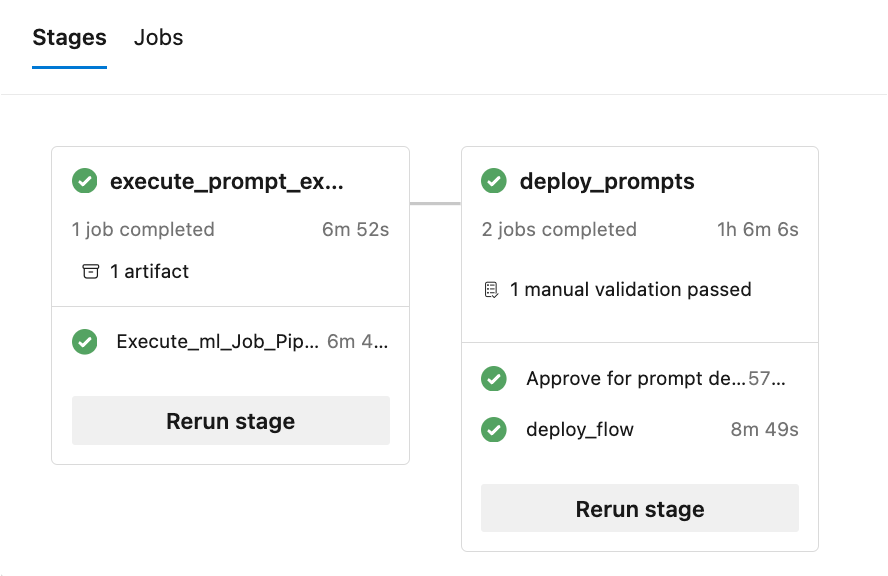

# LLMOps with Prompt flow 
Large Language Model Operations, or LLMOps, has become the cornerstone of efficient prompt engineering and LLM induced application development and deployment. As the demand for LLM induced applications continues to soar, organizations find themselves in need of a cohesive and streamlined process to manage their end-to-end lifecycle.

The rise of AI and large language models (LLMs) has transformed various industries, enabling the development of innovative applications with human-like text understanding and generation capabilities. This revolution has opened up new possibilities across fields such as customer service, content creation, and data analysis.

As LLMs rapidly evolve, the importance of Prompt Engineering becomes increasingly evident. Prompt Engineering plays a crucial role in harnessing the full potential of LLMs by creating effective prompts that cater to specific business scenarios. This process enables developers to create tailored AI solutions, making AI more accessible and useful to a broader audience.

# Challenges in LLMOps

- Managing Large Language based flows, from local experimentation to production deployment, has been far from straightforward and isn't a one-size-fits-all task.

- Each flow has its unique lifecycle, from initial experimentation to deployment, and each stage presents its own set of challenges.

- Organizations often deal with multiple flows concurrently, each with its objectives, requirements, and complexities. This can quickly become overwhelming without proper management tools.

- It involves handling multiple flows, their unique lifecycles, experimentation with various configurations, and ensuring smooth deployments.

# Context

- LLM-infused applications are designed to understand and generate human-like text based on the input they receive. They comprise of prompts that need engineering cadence and rigour.
- Prompt flow is a powerful feature that simplifies and streamlines the Prompt Engineering process for LLM-infused applications. It enables users to create, evaluate, and deploy high-quality flows with ease and efficiency.
- How do we best augment LLM-infused applications with LLMOps and engineering rigour? This template aims to assist in the development of those types of applications using Prompt flow and LLMOps.

# Solution

That's where **LLMOps with Prompt flow** comes in. LLMOps with Prompt flow is a "LLMOps template and guidance" to help you build LLM-infused apps using Prompt flow. It provides the following features:

- **Centralized Code Hosting:** This repo supports hosting code for multiple flows based on prompt flow, providing a single repository for all your flows. Think of this platform as a single repository where all your prompt flow code resides. It's like a library for your flows, making it easy to find, access, and collaborate on different projects.

- **Lifecycle Management:** Each flow enjoys its own lifecycle, allowing for smooth transitions from local experimentation to production deployment.

- **Variant and Hyperparameter Experimentation:** Experiment with multiple variants and hyperparameters, evaluating flow variants with ease. Variants and hyperparameters are like ingredients in a recipe. This platform allows you to experiment with different combinations of variants across multiple nodes in a flow.

- **A/B Deployment:** Seamlessly implement A/B deployments, enabling you to compare different flow versions effortlessly. Just as in traditional A/B testing for websites, this platform facilitates A/B deployment for prompt flow flows. This means you can effortlessly compare different versions of a flow in a real-world setting to determine which performs best.

- **Many-to-many dataset/flow relationships:** Accommodate multiple datasets for each standard and evaluation flow, ensuring versatility in flow test and evaluation. The platform is designed to accommodate multiple datasets for each flow.

- **Multiple Deployment Targets:** The repo supports deployment of flows to Kubernetes and Azure Managed computes driven through configuration ensuring that your flows can scale as needed.

- **Comprehensive Reporting:** Generate detailed reports for each variant configuration, allowing you to make informed decisions. Provides detailed metric collection for all variant bulk runs and experiments, enabling data-driven decisions in csv as well as HTML files.

- Offers BYOF (bring-your-own-flows). A **complete platform** for developing multiple use-cases related to LLM-infused applications.
- Offers **configuration** based development. No need to write extensive boiler-plate code.
- Provides execution of both **prompt experimentation and evaluation** locally as well on cloud.
- Provides **notebooks for local evaluation** of the prompts. Provides library of functions for local experimentation.
- Endpoint testing within pipeline after deployment to check its availability and readiness.
- Provides optional Human-in-loop to validate prompt metrics before deployment.

LLMOps with Prompt flow provides capabilities for both simple as well as complex LLM-infused apps. It is completely customizable to the needs of the application.

# Folder structure

Each use case (set of Prompt flow standard and evaluation flows) should follow the folder structure as shown here:

- .azure-pipelines : It contains the CI and PR related pipelines for Azure DevOps and specific to a use-case
- data             : This folder contains data files related to Prompt flow standard and evaluation flow
- environment      : It contains a dockerfile used for running containers with flows for inferencing on Azure webapps.
- flows            : It should contain minimally two folder - one for standard Prompt flow related files and another for Evaluation flow related file. There can be multiple evaluation flow related folders.
- tests            : contains unit tests for the flows

Additionally, there is a `experiment.yaml` file that configures the use-case (see file [description](./docs/the_experiment_file.md) and [specs](./docs/experiment.yaml) for more details). There is also a sample-request.json file containing test data for testing endpoints after deployment.

- The '.azure-pipelines' folder contains the common Azure DevOps pipelines for the platform and any changes to them will impact execution of all the flows.

- The '.github' folder contains the Github workflows for the platform as well as the use-cases. This is bit different than Azure DevOps because all Github workflows should be within this single folder for execution.

- The '.jenkins' folder contains the Jenkins declarative pipelines for the platform as well as the use-cases and individual jobs.

- The 'docs' folder contains documentation for step-by-step guides for both Azure DevOps, Github Workflow and Jenkins related configuration.

- The 'llmops' folder contains all the code related to flow execution, evaluation and deployment.

- The 'local_execution' folder contains python scripts for executing both the standard and evaluation flow locally.

# Documentation

- Full documentation on using this repo using Azure DevOps can be found [here](./docs/Azure_devops_how_to_setup.md)
- Full documentation on using this repo using Github Workflows can be found [here](./docs/github_workflows_how_to_setup.md)
- Full documentation on using this repo using Jenkins can be found [here](./docs/jenkins_how_to_setup.md)
- Documentation about adding a new flow is available [here](./docs/how_to_onboard_new_flows.md)
- New experiment.yaml configuration [here](./docs/the_experiment_file.md)

# Deployment

The repo helps in deploying to **Kubernetes, Kubernetes ARC , Azure Web Apps and AzureML Managed compute** along with **A/B deployment** for AzureML Managed compute.


# Pipeline

The pipeline execution consists of multiple stages and jobs in each stage:



# Reports

The repo generates multiple reports (experiments-runs and metrics examples are shown) :


# Local Execution

To harness the capabilities of the **local execution**, follow these installation steps:

1. **Clone the Repository**: Begin by cloning the template's repository from its [GitHub repository](https://github.com/microsoft/llmops-promptflow-template.git).

```bash
git clone https://github.com/microsoft/llmops-promptflow-template.git
```

2. **setup env file**: create .env file at top folder level and provide information for items mentioned. Add as many connection names as needed. All the flow examples in this repo uses AzureOpenAI connection named `aoai`. Add a line `aoai={"api_key": "","api_base": "","api_type": "azure","api_version": "2023-03-15-preview"}` with updated values for api_key and api_base. If additional connections with different names are used in your flows, they should be added accordingly. Currently, flow with AzureOpenAI as provider as supported. 

```bash

experiment_name=
connection_name_1={ "api_key": "","api_base": "","api_type": "azure","api_version": "2023-03-15-preview"}
connection_name_2={ "api_key": "","api_base": "","api_type": "azure","api_version": "2023-03-15-preview"}
```
3. Prepare the local conda or virtual environment to install the dependencies.

```bash

python -m pip install promptflow promptflow-tools promptflow-sdk jinja2 promptflow[azure] openai promptflow-sdk[builtins] python-dotenv

```

4. Bring or write your flows into the template based on documentation [here](./docs/how_to_onboard_new_flows.md).

5. Write python scripts similar to the provided examples in local_execution folder.

## Contributing

This project welcomes contributions and suggestions.  Most contributions require you to agree to a
Contributor License Agreement (CLA) declaring that you have the right to, and actually do, grant us
the rights to use your contribution. For details, visit https://cla.opensource.microsoft.com.

When you submit a pull request, a CLA bot will automatically determine whether you need to provide
a CLA and decorate the PR appropriately (e.g., status check, comment). Simply follow the instructions
provided by the bot. You will only need to do this once across all repos using our CLA.

This project has adopted the [Microsoft Open Source Code of Conduct](https://opensource.microsoft.com/codeofconduct/).
For more information see the [Code of Conduct FAQ](https://opensource.microsoft.com/codeofconduct/faq/) or
contact [opencode@microsoft.com](mailto:opencode@microsoft.com) with any additional questions or comments.

## Trademarks

This project may contain trademarks or logos for projects, products, or services. Authorized use of Microsoft 
trademarks or logos is subject to and must follow 
[Microsoft's Trademark & Brand Guidelines](https://www.microsoft.com/en-us/legal/intellectualproperty/trademarks/usage/general).
Use of Microsoft trademarks or logos in modified versions of this project must not cause confusion or imply Microsoft sponsorship.
Any use of third-party trademarks or logos are subject to those third-party's policies.

## Code of Conduct

This project has adopted the
[Microsoft Open Source Code of Conduct](https://opensource.microsoft.com/codeofconduct/).
For more information see the
[Code of Conduct FAQ](https://opensource.microsoft.com/codeofconduct/faq/)
or contact [opencode@microsoft.com](mailto:opencode@microsoft.com)
with any additional questions or comments.

## License

Copyright (c) Microsoft Corporation. All rights reserved.

Licensed under the [MIT](LICENSE) license.
