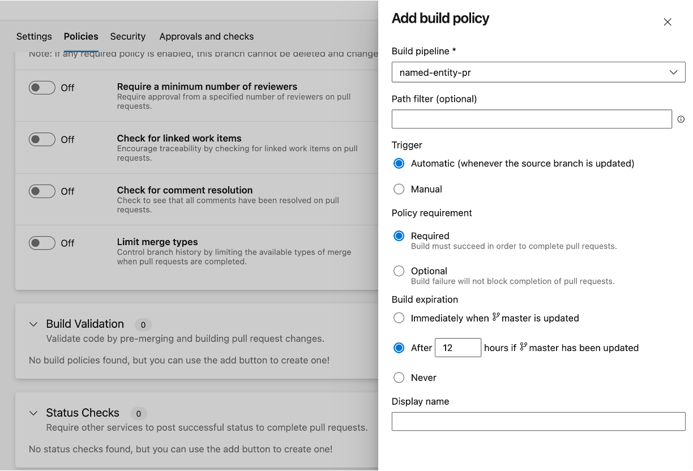

# How to setup the repo with Azure DevOps

This template supports Azure Machine Learning(ML) as a platform for LLMOps, and Azure DevOps pipelines as a platform for Flow operationalization. LLMOps with Prompt Flow provides automation of:

* Running Prompt flow after a Pull Request
* Running multiple Prompt flow evaluation to ensure results are high quality 
* Registering of prompt flow models
* Deployment of prompt flow models
* Deployment to Kubernetes and/or Azure ML compute
* A/B deployments
* Role based access control(RBAC) permissions to deployment system managed id to keyvault and Azure ML workspace
* Endpoint testing
* Report generation

It is recommended to understand how [Prompt flow works](https://learn.microsoft.com/en-us/azure/machine-learning/prompt-flow/get-started-prompt-flow?view=azureml-api-2) before using this template.

## Prerequisites

- An Azure subscription. If you don't have an Azure subscription, create a free account before you begin. Try the [free or paid version of Machine Learning](https://azure.microsoft.com/free/).
- A Machine Learning workspace.
- Git running on your local machine.
- Azure DevOps project as the source control repository
- Azure OpenAI with Model deployed with name (gpt-35-turbo)

Prompt Flow runtimes are optional by default for this template. The template uses the concept of 'automatic runtime' where flows are executed within a runtime provisioned automatically during execution. The first execution might need additional time for provisioning of the runtime. The template supports using dedicated compute instances and runtimes and they can be enabled easily with minimal change in code. (search for COMPUTE_RUNTIME in code for such changes)

## Create service principal

Create one Azure service principal for the purpose of understanding this repository. You can add more depending on number of environments, you want to work on (Dev or Prod or Both). Service principals can be created using cloud shell, bash, powershell or from Azure UI. If your subscription is part of an organization with multiple tenants, ensure that the Service Principal has access across tenants. 

1. Copy the following bash commands to your computer and update the **spname** and  **subscriptionId** variables with the values for your project. This command will also grant the **Contributor** role to the service principal in the subscription provided. This is required for GitHub Actions to properly use resources in that subscription. 

    ``` bash
    spname="<your sp name>"
    roleName="Owner"
    subscriptionId="<subscription Id>"
    servicePrincipalName="Azure-ARM-${spname}"

    # Verify the ID of the active subscription
    echo "Using subscription ID $subscriptionID"
    echo "Creating SP for RBAC with name $servicePrincipalName, with role $roleName and in scopes     /subscriptions/$subscriptionId"
    
    az ad sp create-for-rbac --name $servicePrincipalName --role $roleName --scopes /subscriptions/$subscriptionId --sdk-auth 
    
    echo "Please ensure that the information created here is properly save for future use."

1. Copy your edited commands into the Azure Shell and run them (**Ctrl** + **Shift** + **v**). If executing the commands on local machine, ensure Azure CLI is installed and successfully able to access after executing `az login` command. Azure CLI can be installed using information available [here](https://learn.microsoft.com/en-us/cli/azure/install-azure-cli)

1. After running these commands, you'll be presented with information related to the service principal. Save this information to a safe location, you'll use it later in the demo to configure GitHub.

    ```json

      {
      "clientId": "<service principal client id>",  
      "clientSecret": "<service principal client secret>",
      "subscriptionId": "<Azure subscription id>",  
      "tenantId": "<Azure tenant id>",
      "activeDirectoryEndpointUrl": "https://login.microsoftonline.com",
      "resourceManagerEndpointUrl": "https://management.azure.com/", 
      "activeDirectoryGraphResourceId": "https://graph.windows.net/", 
      "sqlManagementEndpointUrl": "https://management.core.windows.net:8443/",
      "galleryEndpointUrl": "https://gallery.azure.com/",
      "managementEndpointUrl": "https://management.core.windows.net/" 
      }
    ```

1. Copy all of this output, braces included. Save this information to a safe location, it will be use later in the demo to configure GitHub Repo.

1. Close the Cloud Shell once the service principals are created. 

## Set up authentication with Azure and Azure DevOps

Create a service connection in Azure DevOps. You can use [this document](https://learn.microsoft.com/en-us/azure/devops/pipelines/library/service-endpoints?view=azure-devops&tabs=yaml) as a reference. Use Azure Resource Manager as a type of the service connection. 

From your Azure DevOps project, select `**Project Settings** -> **Service connections** -> **New Service connection** -> **Azure Resource Manager** and **Service Principal(manual)**`. Fill the form with relevant data related to Service Principal, test and save the connection.


## Create a Azure DevOps Variable Group

Create a new variable group (llmops_platform_dev_vg) with the following variables:

- AZURE_RM_SVC_CONNECTION: the service connection name from the previous step.


Information about variable groups in Azure DevOps can be found in [this document](https://learn.microsoft.com/en-us/azure/devops/pipelines/library/variable-groups?view=azure-devops&tabs=classic).

## Set up Azure DevOps Repo

Clone this repository [LLMOps Prompt Flow Template Repo](https://github.com/microsoft/llmops-promptflow-template) locally on your workstation. This repo has reusable LLMOps code that can be used across multiple projects. 

Clone your Azure DevOps repo as well and copy the code from Github repo just cloned into the Azure DevOps related git repo. Ensure the .git folder is not copied.

Create a *development* branch and make it as default one to make sure that all PRs should go towards to it. This template assumes that the team works at a *development* branch as a primary source for coding. Later, you can implement Azure Pipeline that mode code from the *development* branch into qa/main or execute a release process right away. Release management is not in scope of this template.

Create two Azure Pipelines for each use case (e.g. named_entity_recognition). Both Azure Pipelines should be created based on existing YAML files. The first one is based on the [named_entity_recognition_pr_dev_pipeline.yml](../named_entity_recognition/.azure-pipelines/named_entity_recognition_pr_dev_pipeline.yml), and it helps to maintain code quality for all PRs including integration tests for the Azure ML experiment. Usually, we recommend to have a toy dataset for the integration tests to make sure that the Prompt Flow job can be completed fast enough - there is not a goal to check prompt quality and we just need to make sure that our job can be executed. The second Azure Pipeline is based on [named_entity_recognition_ci_dev_pipeline.yml](../named_entity_recognition/.azure-pipelines/named_entity_recognition_ci_dev_pipeline.yml) is executed automatically once new PR has been merged into the *development* or *main* branch. The main idea of this pipeline is to execute bulk run, evaluation on the full dataset for all prompt variants. Both the workflow can be modified and extended based on the project's requirements. 

More details about how to create a basic Azure Pipeline can be found [here](https://learn.microsoft.com/en-us/azure/devops/pipelines/create-first-pipeline?view=azure-devops&tabs).

Setup a policy for the *development* branch. At this stage we have an Azure Pipeline that should be executed on every PR to the *development* branch. At the same time successful completion of the build is not a requirement. So, it's important to add our PR build as a policy. Pay special attention that [named_entity_recognition_pr_dev_pipeline.yml](../named_entity_recognition/.azure-pipelines/named_entity_recognition_pr_dev_pipeline.yml) has various paths in place. We are using these paths to limit number of runs if the current PR doesn't affect ML component (for example, PR modifies a documentation file). Therefore, setting up the policy you need to make sure that you are using the same set of paths in the *Path filter* field.

From your Azure DevOps project, select `**Repos** -> **Branches** ->  **more options button against a branch ** -> **Branch policies** -> **Build validation**` and fill the form using the appropriate PR pipeline.




More details about how to create a policy can be found [here](https://learn.microsoft.com/en-us/azure/devops/repos/git/branch-policies?view=azure-devops&tabs=browser).

## Setup connections for Prompt flow 

Prompt Flow Connections helps securely store and manage secret keys or other sensitive credentials required for interacting with LLM and other external tools for example Azure OpenAI.

This repository has 3 examples and all the examples uses connection named `aoai` inside, we need to set up a connection with this name if we haven’t created it before.

This repository has all the examples using Azure OpenAI model `gpt-35-turbo`` deployed with the same name `gpt-35-turbo`, we need to set up this deployment if we haven’t created it before. 

Please go to Azure Machine Learning workspace portal, click `Prompt flow` -> `Connections` -> `Create` -> `Azure OpenAI`, then follow the instruction to create your own connections called `aoai`. Learn more on [connections](https://learn.microsoft.com/en-us/azure/machine-learning/prompt-flow/concept-connections?view=azureml-api-2). The samples uses a connection named "aoai" connecting to a gpt-35-turbo model deployed with the same name in Azure OpenAI. This connection should be created before executing the out-of-box flows provided with the template.


The configuration for connection used while authoring the repo:


## Update configurations for Prompt flow and Azure DevOps pipeline

There are multiple configuration files for enabling Prompt Flow run and evaluation in Azure ML and Azure DevOps pipelines.

### Update config.json

Modify the configuration values in config.json file available for each example based on description.

- `ENV_NAME`:  This represents the environment type. (The template supports *pr* and *dev* environments.)
- `RUNTIME_NAME`:  This is name of a Prompt Flow runtime environment, used for executing the prompt flows. Use this only when using dedicated runtime and compute. The template uses automatic runtime be default.
- `KEYVAULT_NAME`:  This points to an Azure Key Vault, a service for securely storing and managing secrets, keys, and certificates.
- `RESOURCE_GROUP_NAME`:  Name of the Azure resource group related to Azure ML workspace.
- `WORKSPACE_NAME`:  This is name of Azure ML workspace.
- `STANDARD_FLOW_PATH`:  This is relative folder path to files related to a standard flow. e.g.  e.g. "flows/standard_flow.yml"
- `EVALUATION_FLOW_PATH`:  This is an string value referring to evaluation flow paths. It can have multiple comma seperated values- one for each evaluation flow. e.g. "flows/eval_flow_1.yml,flows/eval_flow_2.yml"

The template uses 'pr' and 'dev' to refer to environment types. The template can be extended by implementing additional environment types.

### Update mapping_config.json in config folder

Modify the configuration values in mapping_config.json file based on both the standard and evaluation flows for an example. These are used in both experiment and evaluation flow execution.

- `experiment`: This section define inputs for standard flow. The values comes from a dataset.
- `evaluation`: This section defines the inputs for the related evaluation flows. The values generally comes from two sources - dataset and output from bulk run. Evaluation involves comparing predictions made during bulk run execution of a standard flow with corresponding expected ground truth values and eventually used to assess the performance of prompt variants.


### Update data_config.json in config folder

Modify the configuration values in data_config.json file based on the environment. These are required in creating data assets in Azure ML and also consume them in pipelines.

- `ENV_NAME`: This indicates the environment name, referring to the "development" or "production" or any other environment where the prompt will be deployed and used in real-world scenarios.
- `DATA_PURPOSE`: This denotes the purpose of the data usage. These includes data for pull-request(pr_data), experimentation(training_data) or evaluation(test_data). These 3 types are supported by the template.
- `DATA_PATH`: This points to the file path e.g. "flows/web_classification/data/data.jsonl".
- `DATASET_NAME`: This is the name used for created Data Asset on Azure ML. Special characters are not allowed for naming of dataset. Special characters are not allowed for naming of dataset.
- `RELATED_EXP_DATASET`: This element is used to relate data used for bulk run with the data used for evaluation. The value is the name of the dataset used for bulk run of standard flows.
- `DATASET_DESC`: This provides a description for the dataset.


### Update deployment_config.json in config folder

**Step 8.** Modify the configuration values in deployment_config.json filefor each environment. These are required for deploying Prompt flows in Azure ML.

- `ENV_NAME`: This indicates the environment name, referring to the "development" or "production" or any other environment where the prompt will be deployed and used in real-world scenarios.
- `TEST_FILE_PATH`: The value represents the file path containing sample input used for testing the deployed model. 
- `ENDPOINT_NAME`: The value represents the name or identifier of the deployed endpoint for the prompt flow.
- `ENDPOINT_DESC`: It provides a description of the endpoint. It describes the purpose of the endpoint, which is to serve a prompt flow online.
- `DEPLOYMENT_DESC`: It provides a description of the deployment itself.
- `DEPLOYMENT_NAME`: The value represents the name or identifier of the deployment. 
- `PRIOR_DEPLOYMENT_NAME`: The name of prior deployment. Used during A/B deployment. The value is "" if there is only a single deployment. Refer to CURRENT_DEPLOYMENT_NAME property for the first deployment. 
- `PRIOR_DEPLOYMENT_TRAFFIC_ALLOCATION`:  The traffic allocation of prior deployment. Used during A/B deployment. The value is "" if there is only a single deployment. Refer to CURRENT_DEPLOYMENT_TRAFFIC_ALLOCATION property for the first deployment. 
- `CURRENT_DEPLOYMENT_NAME`: The name of current deployment.
- `CURRENT_DEPLOYMENT_TRAFFIC_ALLOCATION`: The traffic allocation of current deployment.
- `DEPLOYMENT_TRAFFIC_ALLOCATION`: This parameter represent the percentage allocation of traffic to this deployment. A value of 100 indicates that all traffic is directed to this deployment.
- `DEPLOYMENT_VM_SIZE`: This parameter specifies the size or configuration of the virtual machine instances used for the deployment.
- `DEPLOYMENT_BASE_IMAGE_NAME`: This parameter represent the name of the base image used for creating the Prompt Flow runtime.
-  `DEPLOYMENT_CONDA_PATH`: This parameter specifies the path to a Conda environment configuration file (usually named conda.yml), which is used to set up the deployment environment.
- `DEPLOYMENT_INSTANCE_COUNT`:This parameter specifies the number of instances (virtual machines) that should be deployed for this particular configuration.
- `ENVIRONMENT_VARIABLES`: This parameter represents a set of environment variables that can be passed to the deployment.

Kubernetes deployments have addtional properties - `COMPUTE_NAME`, `CPU_ALLOCATION` and `MEMORY_ALLOCATION` related to infrastructure and resource requirements.

### Update data folder with data files

Add your data into data folder under use case folder. It supports jsonl files and the examples already contains data files for both running and evaluating Prompt Flows. Refer to data_

### Update Standard and evaluation flows

The flows folder contains one folder for each standard and evaluation flow. Each example in the repository already has these flows. 

### Update Environment related dependencies

The Environment folder contains conda.yml file and any additional dependencies needed by the flow should be added to it. This file is used during deployment process.

### Update test data

The sample-request.json file contains a single test data used for testing the online endpoint after deployment in the pipeline. Each example has its own sample-request.json file and for custom flows, it should be update to reflect test data needed for testing.

### Update email Id for notification

Manual approval is enabled by default. The template uses a dummy `replace@youremail.com` email Id. Replace this with valid email address in code.

## Example Prompt Run, Evaluation and Deployment Scenario

There are three examples in this template. While named_entity_recognition and math_coding has same functionality, web_classification has multiple evaluation flows and datasets for dev environment. This is a flow in general across all examples.

 

This Azure DevOps CI pipelines contains the following steps:

**Run Prompts in Flow**
- Upload bulk run dataset
- Bulk run prompt flow based on dataset.
- Bulk run each prompt variant 

**Evaluate Results**
- Upload ground test dataset
- Execution of multiple evaluation flows for a single bulk run (only for web_classification)
- Evaluation of the bulk run result using single evaluation flow (for others)

**Manual Approval**
- approval required before deployment 

**Register Prompt Flow LLM App**
- Check in logic, Customer defined logic (accuracy rate, if >=90% you can deploy)

**Deploy and Test LLM App**
- Deploy the Flow as a model to development environment either as Kubernetes or Azure ML Compute endpoint
- Assign RBAC permissions to the newly deployed endpoint related to Key Vault and Azure ML workspace
- Test the model/promptflow realtime endpoint.


### Online Endpoint  
      
1. After the CI pipeline for an example scenario has run successfully, depending on the configuration it will either deploy to 

      or to a kubernetes compute type

      
   
2. Once pipeline execution completes, it would have successfully completed the test using data from sample-request file as well. 

     

## Moving to production

The example scenario can be run and deployed both for Dev environments. When you are satisfied with the performance of the prompt evaluation pipeline, Prompt Flow model, and deployment in development, additional pipelines similar to `dev` pipelines can be replicated and deployed in the Production environment.

The sample Prompt flow run & evaluation and Azure DevOps pipelines can be used as a starting point to adapt your own prompt engineering code and data.