# How to setup the repo with Azure DevOps

This template supports Azure Machine Learning (ML) as a platform for LLMOps, and Azure DevOps pipelines as a platform for Flow operationalization. LLMOps with Prompt flow provides automation of:

* Experimentation by executing prompt flow 'flows'
* Evaluation of prompts along with their variants  
* Registration of prompt flow 'flows'
* Deployment of prompt flow 'flows'
* Generation of Docker Image
* Deployment to Kubernetes, Azure Web Apps and Azure ML compute
* A/B deployments
* Role based access control (RBAC) permissions to deployment system managed id to key vault and Azure ML workspace
* Endpoint testing
* Report generation

It is important to understand how [Prompt flow works](https://learn.microsoft.com/en-us/azure/machine-learning/prompt-flow/get-started-prompt-flow?view=azureml-api-2) before using this template.

## Prerequisites

- An Azure subscription. If you don't have an Azure subscription, create a free account before you begin. Try the [free or paid version of Machine Learning](https://azure.microsoft.com/free/).
- An Azure Machine Learning workspace.
- Git running on your local machine.
- Azure DevOps organization.
- Azure OpenAI with Model deployed with name `gpt-35-turbo`.
- In case of Kubernetes based deployment, Kubernetes resources and associating it with Azure Machine Learning workspace would be required. More details about using Kubernetes as compute in AzureML is available [here](https://learn.microsoft.com/en-us/azure/machine-learning/how-to-attach-kubernetes-anywhere?view=azureml-api-2).

The template deploys real-time online endpoints for flows. These endpoints have Managed ID assigned to them and in many cases they need access to Azure Machine learning workspace and its associated key vault. The template by default provides access to both the key vault and Azure Machine Learning workspace based on this [document](https://learn.microsoft.com/en-ca/azure/machine-learning/prompt-flow/how-to-deploy-for-real-time-inference?view=azureml-api-2#grant-permissions-to-the-endpoint)

## Setup connections for Prompt flow 

Prompt flow Connections helps securely store and manage secret keys or other sensitive credentials required for interacting with LLM and other external tools for example Azure OpenAI.

This repository has 3 examples and all the examples uses connection named `aoai` inside, we need to set up a connection with this name if we haven’t created it before.

This repository has all the examples using Azure OpenAI model `gpt-35-turbo` deployed with the same name `gpt-35-turbo`, we need to set up this deployment if we haven’t created it before. 

Please go to Azure Machine Learning workspace portal, click `Prompt flow` -> `Connections` -> `Create` -> `Azure OpenAI`, then follow the instruction to create your own connections called `aoai`. Learn more on [connections](https://learn.microsoft.com/en-us/azure/machine-learning/prompt-flow/concept-connections?view=azureml-api-2). The samples uses a connection named "aoai" connecting to a gpt-35-turbo model deployed with the same name in Azure OpenAI. This connection should be created before executing the out-of-box flows provided with the template.

  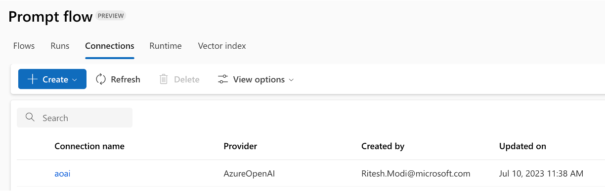

The configuration for connection used while authoring the repo:

  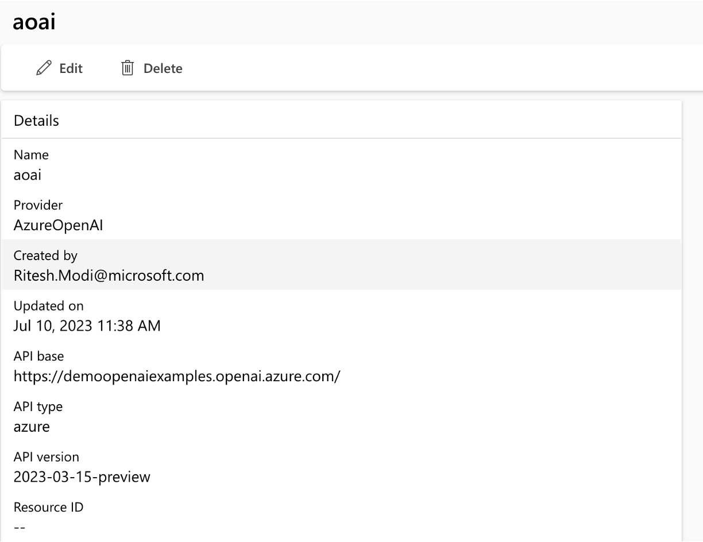


## Create Azure service principal

Create an Azure service principal for the purpose of working with this repository. You can add more depending on number of environments you want to work on (Dev or Prod or Both). Service principals can be created using cloud shell, bash, PowerShell or from Azure UI. If your subscription is a part of organization with multiple tenants, ensure that the Service Principal has access across tenants. 

1. Copy the following bash commands to your computer and update the **spname** (of your choice) and **subscriptionId** variables with the values for your project. This command will also grant the **owner** role to the service principal in the subscription provided. This is required for GitHub Actions to properly use resources in that subscription. 

    ``` bash
    spname="<provide a name to create a new sp name>"
    roleName="Owner"
    subscriptionId="<provide your subscription Id>"
    servicePrincipalName="Azure-ARM-${spname}"

    # Verify the ID of the active subscription
    echo "Using subscription ID $subscriptionID"
    echo "Creating SP for RBAC with name $servicePrincipalName, with role $roleName and in scopes     /subscriptions/$subscriptionId"
    
    az ad sp create-for-rbac --name $servicePrincipalName --role $roleName --scopes /subscriptions/$subscriptionId --sdk-auth 
    
    echo "Please ensure that the information created here is properly save for future use."

1. Copy your edited commands into the Azure Shell and run them (**Ctrl** + **Shift** + **v**). If executing the commands on local machine, ensure Azure CLI is installed and successfully able to access after executing `az login` command. Azure CLI can be installed using information available [here](https://learn.microsoft.com/en-us/cli/azure/install-azure-cli)

1. After running these commands, you'll be presented with information related to the service principal. Save this information to a safe location, you'll use it later in the demo to configure GitHub. 

`NOTE: The below information should never be part of your repository and its branches. These are important secrets and should never be pushed to any branch in any repository.`

    ```json

      {
      "clientId": "<service principal client id>",  
      "clientSecret": "<service principal client secret>",
      "subscriptionId": "<Azure subscription id>",  
      "tenantId": "<Azure tenant id>",
      "activeDirectoryEndpointUrl": "https://login.microsoftonline.com",
      "resourceManagerEndpointUrl": "https://management.azure.com/", 
      "activeDirectoryGraphResourceId": "https://graph.windows.net/", 
      "sqlManagementEndpointUrl": "https://management.core.windows.net:8443/",
      "galleryEndpointUrl": "https://gallery.azure.com/",
      "managementEndpointUrl": "https://management.core.windows.net/" 
      }
    ```

1. Copy the output, braces included. It will be used later in the demo to configure GitHub Repo.

1. Close the Cloud Shell once the service principals are created. 

## Setup runtime for Prompt flow 

Prompt flow 'flows' require runtime associated with compute instance in Azure Machine Learning workspace. Both the compute instance and the associated runtime should be created prior to executing the flows. Both the Compute Instance and Prompt flow runtime should be created using the Service Principal. This ensures that Service Principal is the owner of these resources and Flows can be executed on them from both Azure DevOps pipelines and Github workflows. This repo provides Azure CLI commands to create both the compute instance and the runtime using Service Principal. 

Compute Instances and Prompt flow runtimes can be created using cloud shell, local shells, or from Azure UI. If your subscription is a part of organization with multiple tenants, ensure that the Service Principal has access across tenants. The steps shown next can be executed from Cloud shell or any shell. The steps mentioned are using Cloud shell and they explicitly mentions any step that should not be executed in cloud shell.

### Steps:

1. Assign values to variables. Copy the following bash commands to your computer and update the variables with the values for your project. Note that there should not be any spaces between both side of "=" operator while assigning values to bash variables.

```bash
subscriptionId=<your azure subscription id>
rgname=<your resource group name>                                                                      
workspace_name=<your Azure machine learning workspace name> 
userAssignedId=<provide a name to create a new user assigned managed identifier>
keyvault=<your Azure machine learning workspace associate key vault name>
compute_name=<provide a name to create a new Azure ML compute>
location=<your Azure machine learning workspace region>
runtimeName=<provide a name to create a new Prompt Flow runtime>
sp_id=<your azure service principal or client id that was recently created>
sp_password=<your service principal password or clientSecret from previous step>
tenant_id=<your azure tenant id>
```

2. This next set of commands should not be performed from Cloud shell. It should be performed if you are using a local terminal. The commands help to interactively log in to Azure and selects a subscription.

```bash
az login
az account set -s $subscriptionId
```

3. Create a user-assigned managed identity 

```bash
az identity create -g $rgname -n $userAssignedId --query "id"
```

4. Get id, principalId of user-assigned managed identity

```bash
um_details=$(az identity show -g $rgname -n $userAssignedId --query "[id, clientId, principalId]")
```

5. Get id of user-assigned managed identity

```bash
user_managed_id="$(echo $um_details | jq -r '.[0]')"
```

6. Get principal Id of user-assigned managed identity

```bash
principalId="$(echo $um_details | jq -r '.[2]')"
```

7. Grant the user managed identity permission to access the workspace (AzureML Data Scientist)

```bash
az role assignment create --assignee $principalId --role "AzureML Data Scientist" --scope "/subscriptions/$subscriptionId/resourcegroups/$rgname/providers/Microsoft.MachineLearningServices/workspaces/$workspace_name"
```

8. Grant the user managed identity permission to access the workspace keyvault (get and list)

```bash
az keyvault set-policy --name $keyvault --resource-group $rgname --object-id $principalId --secret-permissions get list         
```

9. login with Service Principal

```bash
az login --service-principal -u $sp_id -p $sp_password --tenant $tenant_id
az account set -s $subscriptionId
```

10. Create compute instance and assign user managed identity to it

```bash
az ml compute create --name $compute_name --size Standard_E4s_v3 --identity-type UserAssigned --type ComputeInstance --resource-group $rgname --workspace-name $workspace_name --user-assigned-identities $user_managed_id
```

11. Get Service Principal Azure Entra token for REST API

```bash
access_token=$(az account get-access-token | jq -r ".accessToken")
```

12. Construct POST url for runtime

```bash
runtime_url_post=$(echo "https://ml.azure.com/api/$location/flow/api/subscriptions/$subscriptionId/resourceGroups/$rgname/providers/Microsoft.MachineLearningServices/workspaces/$workspace_name/FlowRuntimes/$runtimeName?asyncCall=true")
```

13. Construct GET url for runtime

```bash
runtime_url_get=$(echo "https://ml.azure.com/api/$location/flow/api/subscriptions/$subscriptionId/resourceGroups/$rgname/providers/Microsoft.MachineLearningServices/workspaces/$workspace_name/FlowRuntimes/$runtimeName")
```

14. Create runtime using REST API

```bash
curl --request POST \
  --url "$runtime_url_post" \
  --header "Authorization: Bearer $access_token" \
  --header 'Content-Type: application/json' \
  --data "{
    \"runtimeType\": \"ComputeInstance\",
    \"computeInstanceName\": \"$compute_name\",
}"
```

15. Get runtime creation status using REST API. Execute this step multiple times unless either you get output that shows createdOn with a valid date and time value or failure. In case of failure, troubleshoot the issue before moving forward.

```bash
curl --request GET \
  --url "$runtime_url_get" \
  --header "Authorization: Bearer $access_token"
```

The template also provides support for 'automatic runtime' where flows are executed within a runtime provisioned automatically during execution. This feature is in preview. The first execution might need additional time for provisioning of the runtime. 

The template supports using 'automatic runtime' and dedicated compute instances and runtimes. This is configured in the `experiment.yaml` file (see file [description](./the_experiment_file.md) and [specs](./experiment.yaml)).

## Create new Azure DevOps project

1. Create an Azure DevOps project to establish a repository for source code and CI/CD execution for Prompt flows. Information about creating a new project in Azure DevOps can be found [here](https://learn.microsoft.com/en-us/azure/devops/organizations/projects/create-project?view=azure-devops&tabs=browser) .

  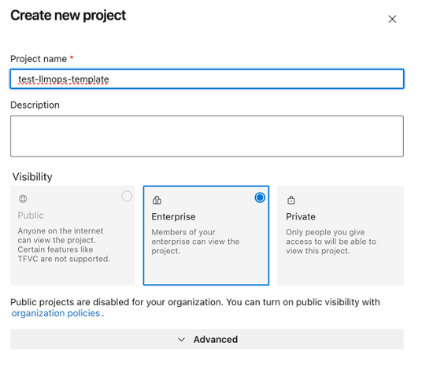

Do not initialize the repository. If you created an empty repo with no README or .gitignore files, you'll see instructions on how to clone the repo to your computer. You'll also see instructions on how to push code in an existing repo into the newly created one. The repo should look like the image shown here. 

  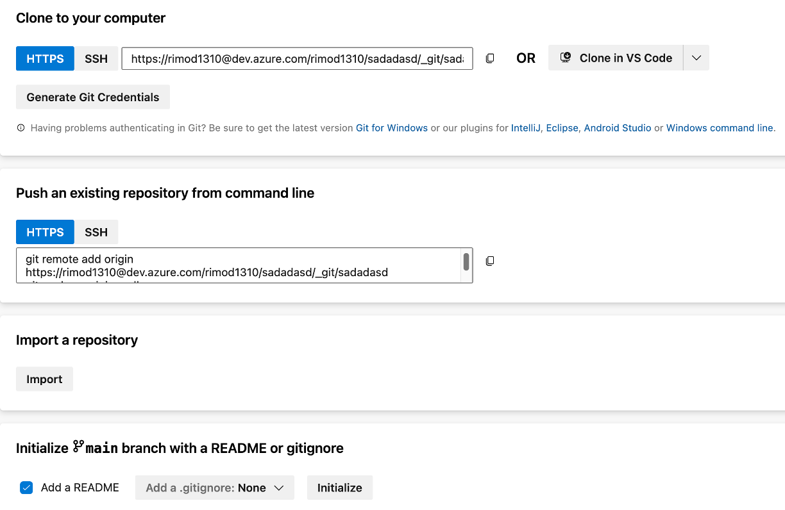

2. Get the url of the repo and note it somewhere for its usage in next steps.

  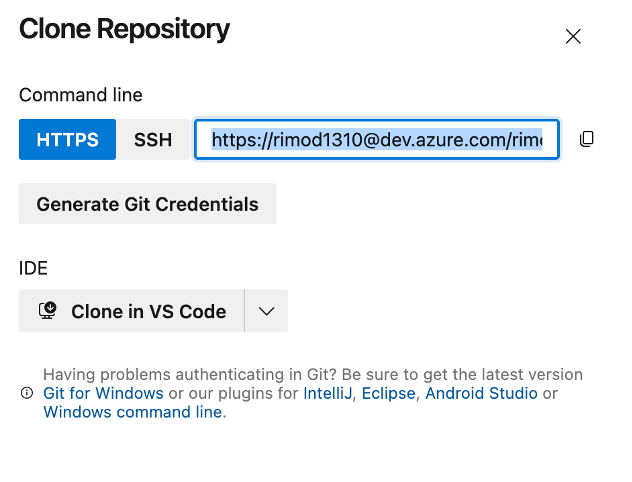

## Set up authentication with Azure and Azure DevOps

Create a service connection named `azure_connection` in Azure DevOps. You can use [this document](https://learn.microsoft.com/en-us/azure/devops/pipelines/library/service-endpoints?view=azure-devops&tabs=yaml) as a reference. Use Azure Resource Manager as a type of the service connection. 

From your Azure DevOps project, select `Project Settings -> Service connections -> New Service connection -> Azure 
Resource Manager -> Service Principal (manual)`. Fill the form with relevant data related to Service Principal, test 
and save the connection with the name `azure_connection` (it is used in the pipelines in this repo). Note: Service principal key is `clientSecret` field from the Service principal configs.

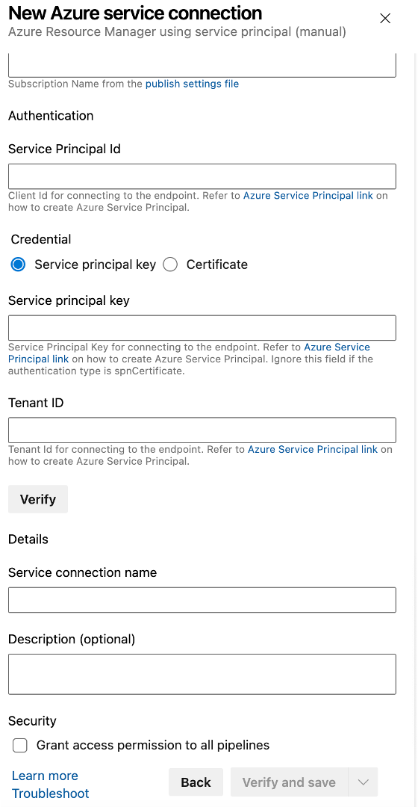

## Create an Azure DevOps Variable Group

Create a new variable group `llmops_platform_dev_vg` ([follow the documentation](https://learn.microsoft.com/en-us/azure/devops/pipelines/library/variable-groups?view=azure-devops&tabs=classic)) with the following variables:

- **AZURE_RM_SVC_CONNECTION**: the name of service connection created in previous step.
- **rg_name**: Name of the resource group containing the Azure ML Workspace
- **ws_name**: Name of the Azure ML Workspace
- **kv_name**: Name of the Key Vault associated with the Azure ML Workspace

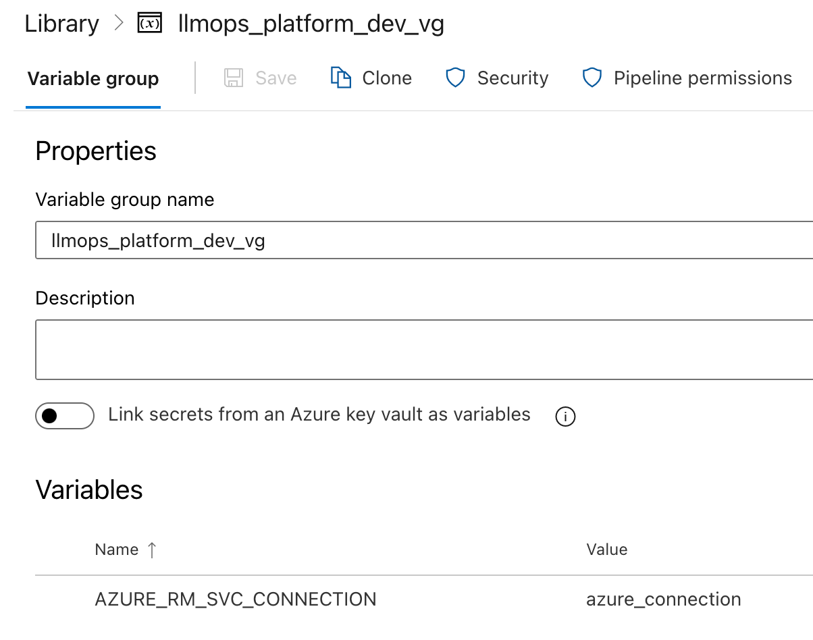

## Set up addition Variables in Azure DevOps

### Prompt flow Connection variable

Create a variable named 'COMMON_DEV_CONNECTIONS' within the llmops_platform_dev_vg variable group with information related to Prompt flow connections. The value for this secret is a json string with given structure as shown next. Create one json object for each connection as shown in example. As of now, Azure Open AI Connections are supported and more will get added soon. Information for each connection can be obtained from respective Azure OpenAI resource.

It is important to note that there can be any number of variables and each storing Prompt flow connection details as shown next and they can be named anything permissible based on your preference. You should use the same variable in your use-case related CI pipelines. The template by default uses 'COMMON_DEV_CONNECTIONS' for this purpose.

```json
[
{
	"name": "aoai",
	"type": "azure_open_ai",
    "api_base": "https://xxxxxxxxxx/",
    "api_key": "xxxxxxxxxxxx",
    "api_type": "azure",
    "api_version": "2023-03-15-preview"
},
{
	"name": "another_connection",
	"type": "azure_open_ai",
    "api_base": "https://xxxxxxxxxxxx/",
    "api_key": "xxxxxxxxxxxx",
    "api_type": "azure",
    "api_version": "2023-03-15-preview"
}
]

```

### Azure Container Registry variable

Create another variable named 'DOCKER_IMAGE_REGISTRY' within the `llmops_platform_dev_vg` variable group with information related to Docker Image Registry. The value for this secret is also a json string with given structure. Create one json object for each available registry. As of now, Azure Container Registry are supported and more will get added soon. Information for each registry can be obtained from Azure Container Registry resource.

It is important to note that there can be any number of variables and each storing Azure Container Registry details as shown next and they can be named anything permissible based on your preference. You should use the same variable in your use-case related CI pipelines. The template by default uses 'DOCKER_IMAGE_REGISTRY' for this purpose.

```json
[
	{
		"registry_name" : "xxxxxxxx",
		"registry_server" : "xxxx.azurecr.io",
		"registry_username" : "xxxxxxxxx",
		"registry_password": "xxxxxxxxxxxxxx"
	}
]

```

## Configure Azure DevOps local and remote repository

Clone this Github Repository [LLMOps Prompt flow Template](https://github.com/microsoft/llmops-promptflow-template) locally on your workstation. This repo has reusable LLMOps code that can be used across multiple projects. 

``` bash
git clone --branch main https://github.com/microsoft/llmops-promptflow-template.git
cd llmops-promptflow-template
git branch
git fetch origin development:development
git checkout development
git branch
```

4. By default, the cloned repo will point to github remote repo. This should be changed and start pointing to Azure DevOps repository. Update the url pointed by git origin to the Azure DevOps repo url copied from previous step using the following commands. Replace the url with your url and push both main and development branches to Azure DevOps repo.

``` bash
git remote set-url origin https://yoururl@dev.azure.com/yoururl/test-llmops-template/_git/test-llmops-template
git push --all
```

As a result the code for LLMOps Prompt flow template will now be available in Azure DevOps repository. 

  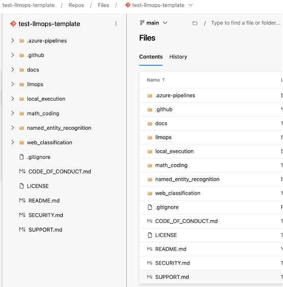

5. `Development` branch should be the default branch in Azure DevOps. If not already set as default branch, it should be configured to be the default branch. This template assumes that the team works at a *development* branch as a primary source for coding. Later, you can implement Azure Pipeline that mode code from the *development* branch into qa/main or execute a release process right away. Release management is not in scope of this template.

  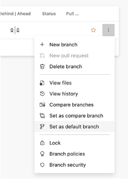


6. Create two Azure Pipelines [[how to create a basic Azure Pipeline](https://learn.microsoft.com/en-us/azure/devops/pipelines/create-first-pipeline?view=azure-devops&tabs)] for each scenario (e.g. named_entity_recognition). Both Azure Pipelines should be created based on existing YAML files:

- The first one is based on the [named_entity_recognition_pr_dev_pipeline.yml](../named_entity_recognition/.azure-pipelines/named_entity_recognition_pr_dev_pipeline.yml), and it helps to maintain code quality for all PRs including integration tests for the Azure ML experiment. Usually, we recommend to have a toy dataset for the integration tests to make sure that the Prompt flow job can be completed fast enough - there is not a goal to check prompt quality and we just need to make sure that our job can be executed. 

- The second Azure Pipeline is based on [named_entity_recognition_ci_dev_pipeline.yml](../named_entity_recognition/.azure-pipelines/named_entity_recognition_ci_dev_pipeline.yml) is executed automatically once new PR has been merged into the *development* or *main* branch. The main idea of this pipeline is to execute bulk run, evaluation on the full dataset for all prompt variants. Both the workflow can be modified and extended based on the project's requirements. 

These following steps should be executed twice - once for PR pipeline and again for CI pipeline.
  
  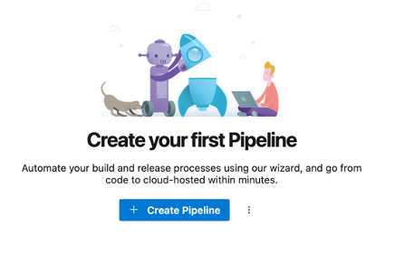
  
In resultant page, select the location of the code - select `Azure Repos Git`
  
  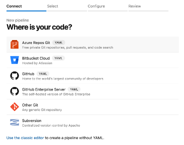
  
In next page, select the repository. There should be only visible repository.   
  
  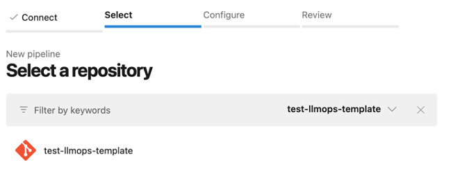

Select `Existing Azure Pipeline YAML file` from resultant page.

  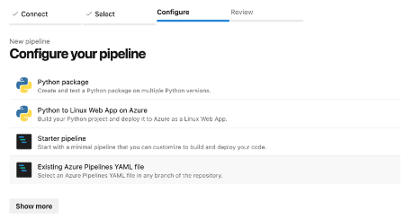
  
select the CI yaml file `named_entity_recognition_ci_dev_pipeline.yml` for named_entity_recognition scenario from the `development` branch.
  
  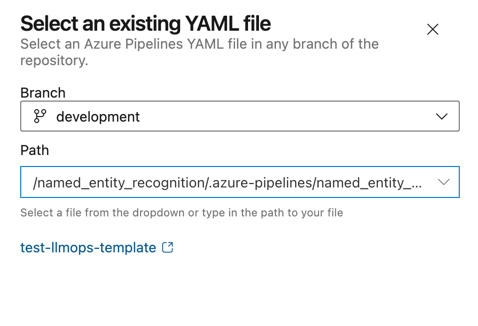

Save the new pipeline.
  
  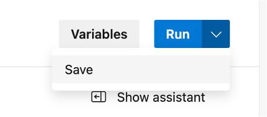
  
Rename the saved pipeline as `named-entity-ci`.

  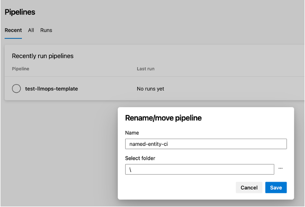
  
Perform the same steps as before for PR pipeline and name is `named-entity-pr`. By the end of this step both the CI and PR pipeline for named_entity_recognition should be available in the Azure DevOps repository.
  

7. Setup a policy for the *development* branch. At this stage we have an Azure Pipeline that should be executed on every PR to the *development* branch. At the same time successful completion of the build is not a requirement. So, it's important to add our PR build as a policy. Pay special attention that [named_entity_recognition_pr_dev_pipeline.yml](../named_entity_recognition/.azure-pipelines/named_entity_recognition_pr_dev_pipeline.yml) has various paths in place. We are using these paths to limit number of runs if the current PR doesn't affect ML component (for example, PR modifies a documentation file). Therefore, setting up the policy you need to make sure that you are using the same set of paths in the *Path filter* field.

From your Azure DevOps project, select `Repos -> Branches -> more options button against development branch -> Branch policies -> Build validation` and fill the form using the appropriate PR pipeline.

  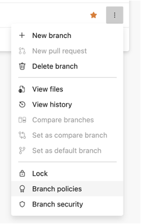
  
  
  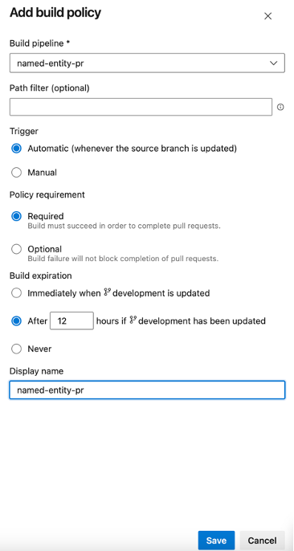

More details about how to create a policy can be found [here](https://learn.microsoft.com/en-us/azure/devops/repos/git/branch-policies?view=azure-devops&tabs=browser).

## Test the pipelines

From local machine, create a new git branch `featurebranch` from `development` branch.

``` bash
git checkout -b featurebranch
```

> **Important**: The pipeline expects the variables `rg_name`, `ws_name` and `kv_name` to be available in the variable group `llmops_platform_dev_vg` (this should have already been created and set [here](#create-an-azure-devops-variable-group)). These variables should contain the values of the Azure resources in the dev environment. To add a new environment, you must create a new variable group `llmops_platform_<env>_vg` and populate it with the variable values from the new environment. This variable group can then be used in the new pipelines created for that environment.

The rest of the pipeline configurations will be read from the `experiment.yaml` file (see file [description](./the_experiment_file.md) and [specs](./experiment.yaml)); and from the `configs/deployment_config.json` file for the deployment.

Before running the deployment pipelines, you need to make changes to `configs/deployment_config.json`:
- Update the `ENDPOINT_NAME` and `CURRENT_DEPLOYMENT_NAME` if you want to deploy to Azure Machine Learning compute
- Or update the `CONNECTION_NAMES`, `REGISTRY_NAME`, `REGISTRY_RG_NAME`, `APP_PLAN_NAME`, `WEB_APP_NAME`, `WEB_APP_RG_NAME`, `WEB_APP_SKU`, and `USER_MANAGED_ID`if you want to deploy to Azure Web App.

### Update config/deployment_config.json

Modify the configuration values in `deployment_config.json` file for each environment. These are required for deploying Prompt flows in Azure ML. Ensure the values for `ENDPOINT_NAME` and `CURRENT_DEPLOYMENT_NAME` are changed before pushing the changes to remote repository.

- `ENV_NAME`: This indicates the environment name, referring to the "development" or "production" or any other environment where the prompt will be deployed and used in real-world scenarios.
- `TEST_FILE_PATH`: The value represents the file path containing sample input used for testing the deployed model. 
- `ENDPOINT_NAME`: The value represents the name or identifier of the deployed endpoint for the prompt flow.
- `ENDPOINT_DESC`: It provides a description of the endpoint. It describes the purpose of the endpoint, which is to serve a prompt flow online.
- `DEPLOYMENT_DESC`: It provides a description of the deployment itself.
- `PRIOR_DEPLOYMENT_NAME`: The name of prior deployment. Used during A/B deployment. The value is "" if there is only a single deployment. Refer to CURRENT_DEPLOYMENT_NAME property for the first deployment. 
- `PRIOR_DEPLOYMENT_TRAFFIC_ALLOCATION`:  The traffic allocation of prior deployment. Used during A/B deployment. The value is "" if there is only a single deployment. Refer to CURRENT_DEPLOYMENT_TRAFFIC_ALLOCATION property for the first deployment. 
- `CURRENT_DEPLOYMENT_NAME`: The name of current deployment.
- `CURRENT_DEPLOYMENT_TRAFFIC_ALLOCATION`: The traffic allocation of current deployment. A value of 100 indicates that all traffic is directed to this deployment.
- `DEPLOYMENT_VM_SIZE`: This parameter specifies the size or configuration of the virtual machine instances used for the deployment.
- `DEPLOYMENT_INSTANCE_COUNT`:This parameter specifies the number of instances (virtual machines) that should be deployed for this particular configuration.
- `ENVIRONMENT_VARIABLES`: This parameter represents a set of environment variables that can be passed to the deployment.

Kubernetes deployments have additional properties - `COMPUTE_NAME`, `DEPLOYMENT_VM_SIZE`, `CPU_ALLOCATION` and `MEMORY_ALLOCATION` related to infrastructure and resource requirements. These should also be updates with your values before executing Kubernetes based deployments.

Azure Web App deployments do not have similar properties as that of Kubernetes and Azure ML compute. For Azure Web App, following properties should be updated.

- `ENV_NAME`: This indicates the environment name, referring to the "development" or "production" or any other environment where the prompt will be deployed and used in real-world scenarios.
- `TEST_FILE_PATH`: The value represents the file path containing sample input used for testing the deployed model.
- `CONNECTION_NAMES`: The name of the connections used in standard flow in json aray format. e.g. ["aoai", "another_connection"].
- `REGISTRY_NAME`: This is the name of the Container Registry that is available in the `DOCKER_IMAGE_REGISTRY` variable in `llmops_platform_dev_vg` variable group. Based on this name, appropriate registry details will be used for `Docker` image management.
- `REGISTRY_RG_NAME`: This is the name of the resource group related to the Container Registry. It is used for downloading the Docker Image.
- `APP_PLAN_NAME`: Name of the App Services plan. It will be provisioned by the pipeline.
- `WEB_APP_NAME`: Name of the Web App. It will be provisioned by the pipeline.
- `WEB_APP_RG_NAME`:  Name of the resource group related to App Service plan and Web App. It will be provisioned by the pipeline.
- `WEB_APP_SKU`: This is the `SKU` (size) of the Web App. e.g. "B3"
- `USER_MANAGED_ID`: This is the name of the user defined managed id created during deployment associated with the Web App.

`NOTE: For Docker based deployments, ensure to add promptflow, promptflow[azure], promptflow-tools packages in each flow's requirements.txt file`. Check-out existing use-cases (named_entity_recognition, math_coding, web_classification) for examples.`

Now, push the new feature branch to the newly forked repo.

``` bash

git add .
git commit -m "changed code"
git push -u origin featurebranch

```
### Execute pipelines

1. Raise a new PR to merge code from `featurebranch` to the `development` branch. 

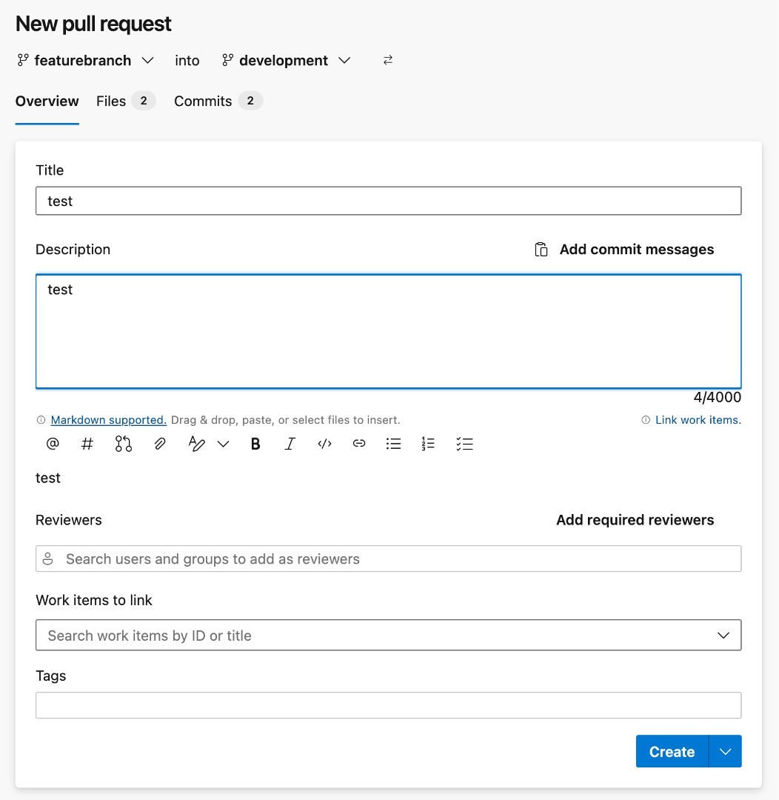

This should start the process of executing the Math_coding PR pipeline.

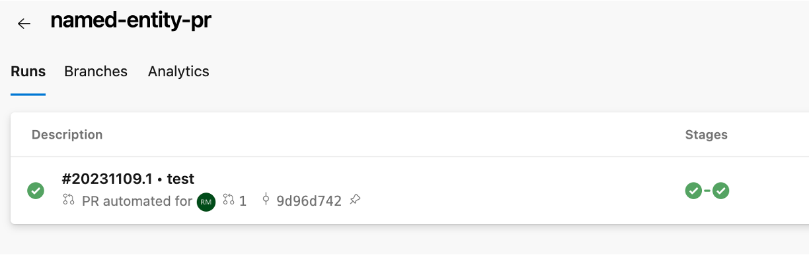

2. After the execution is complete, the code can be merged to the `development` branch.

Now a new PR can be opened from `development` branch to the `main` branch. This should execute both the PR as well as the CI pipeline.

## Update more configurations for Prompt flow and Azure DevOps pipeline

### Update the experiment.yaml file

To make any changes to your experiment set-up, refer to the `experiment.yaml` in the base path of your use-case. This file configures your use-case including flows and datasets. (see file [description](./the_experiment_file.md) and [specs](./experiment.yaml) for more details).

### Update data folder with data files

Add your data into data folder under use case folder. It supports jsonl files and the examples already contains data files for both running and evaluating Prompt flows.

### Update Standard and evaluation flows

The flows folder contains one folder for each standard and evaluation flow. Each example in the repository already has these flows. 

### Update Environment related dependencies

The `environment folder` contains dockerfile file for webapp and function app deployments. Any additional dependencies needed by the flow should be added to it. This file is used during deployment process..

### Update test data

The sample-request.json file contains a single test record used for testing the online endpoint after deployment from the pipeline. Each example has its own sample-request.json file and for custom flows, it should be updated to reflect test data needed for the scenario.

### Update email Id for notification

Manual approval is enabled by default. The template uses a dummy `replace@youremail.com` email Id. Replace this with valid email address in code.

## Example Prompt Run, Evaluation and Deployment Scenario

There are three examples in this template. While named_entity_recognition and math_coding has same functionality, web_classification has multiple evaluation flows and datasets for dev environment. This is a flow in general across all examples.

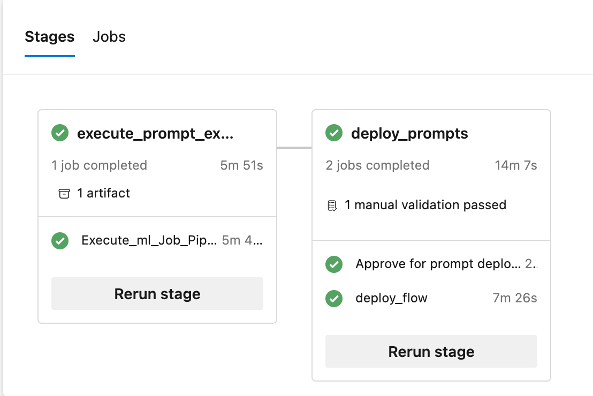 

This Azure DevOps CI pipelines contains the following steps:

**Run Prompts in Flow**
- Upload bulk run dataset
- Bulk run prompt flow based on dataset.
- Bulk run each prompt variant 

**Evaluate Results**
- Upload ground test dataset
- Execution of multiple evaluation flows for a single bulk run (only for web_classification)
- Evaluation of the bulk run result using single evaluation flow (for others)

**Manual Approval**
- approval required before deployment 

**Register Prompt flow LLM App**
- Register Prompt flow as a Model in Azure Machine Learning Model Registry

**Deploy and Test LLM App**
- Deploy the Flow as a model to development environment either as Kubernetes or Azure ML Compute endpoint
- Assign RBAC permissions to the newly deployed endpoint related to Key Vault and Azure ML workspace
- Test the model/promptflow realtime endpoint.

### Online Endpoint  
      
1. After the CI pipeline for an example scenario has run successfully, depending on the configuration it will either deploy to 

     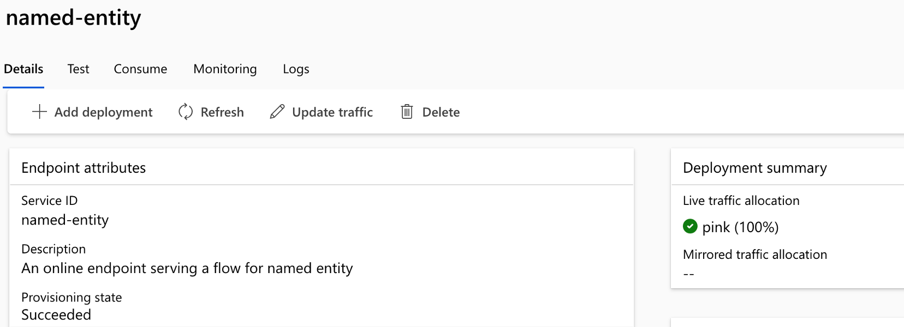 or to a Kubernetes compute type

     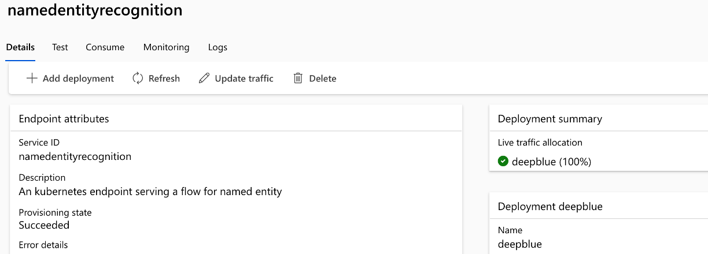 
   
2. Once pipeline execution completes, it would have successfully completed the test using data from sample-request.json file as well. 

     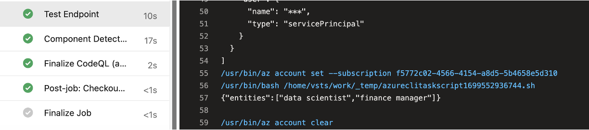

## Moving to production

The example scenario can be run and deployed both for Dev environments. When you are satisfied with the performance of the prompt evaluation pipeline, Prompt flow model, and deployment in development, additional pipelines similar to `dev` pipelines can be replicated and deployed in the Production environment.

The sample Prompt flow run & evaluation and Azure DevOps pipelines can be used as a starting point to adapt your own prompt engineering code and data.