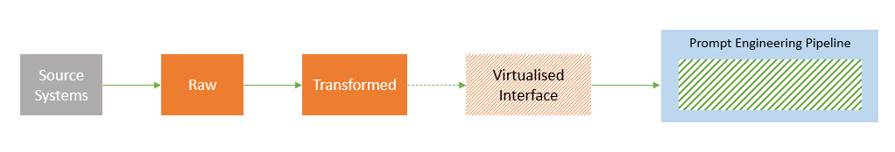

# DataOps for LLMOps

DataOps combines aspects of DevOps, agile methodologies, and data management practices to streamline the process of collecting, processing, and analyzing data. DataOps can help to bring discipline in building the training, experimentation and evaluation datasets for LLM ap development.

During development phase, it helps seperating the data pipeline development from prompt engineering. As a result, team can scale easily and deliver fast. It also helps with easy troubleshooting of issues when the project moves to productiom.

## Architecture

## Folder Structure

