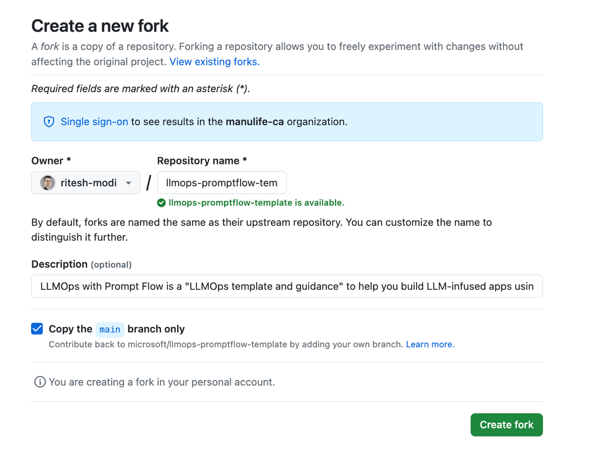
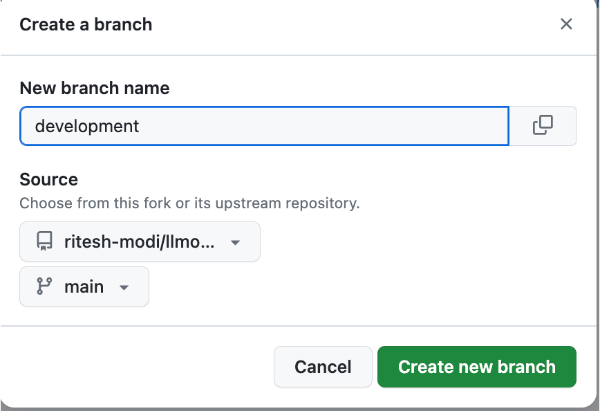
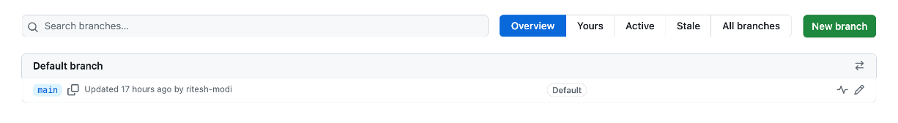
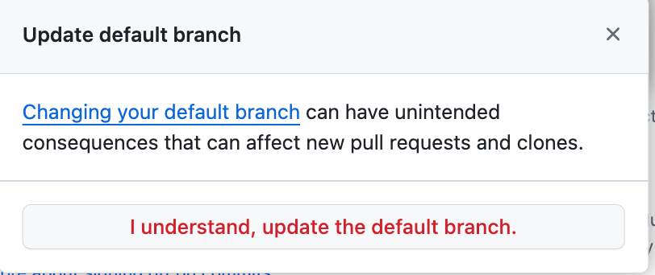
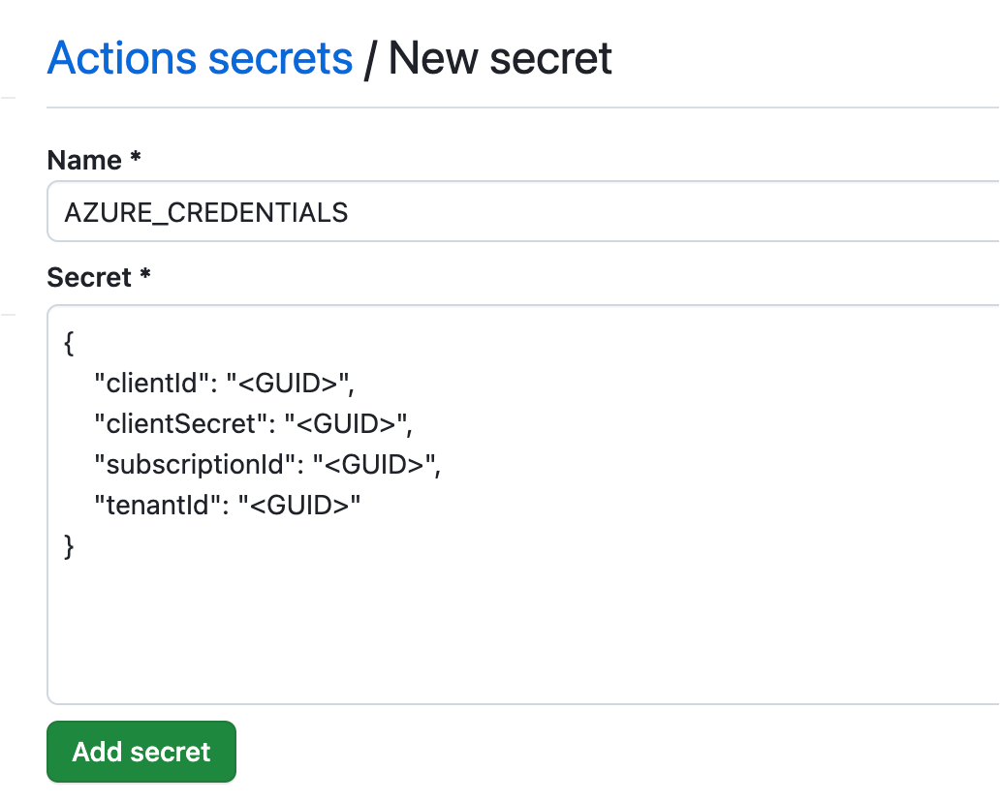
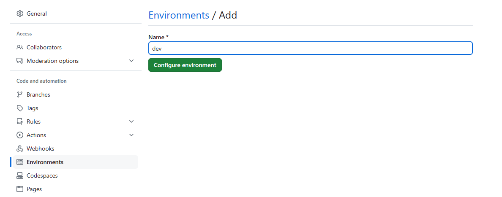
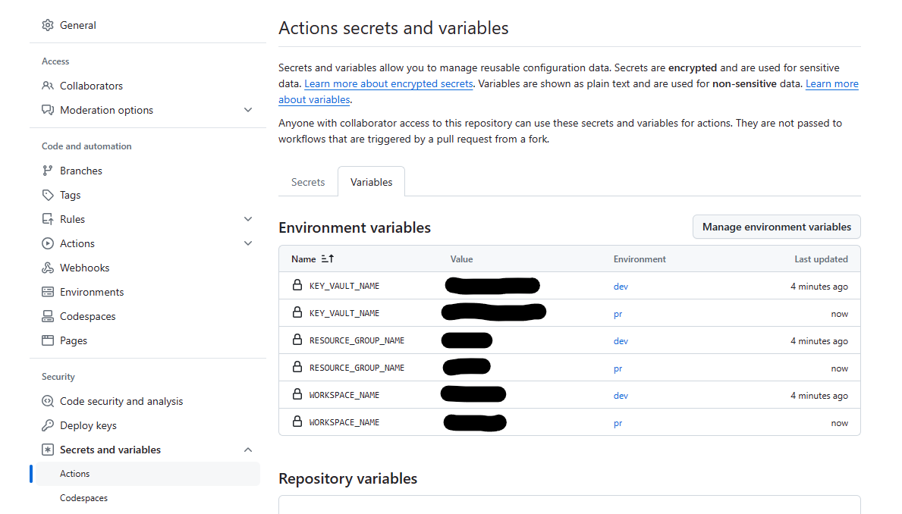
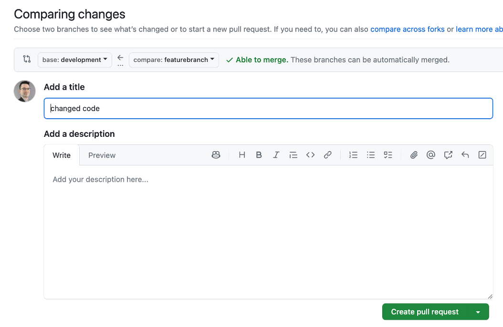
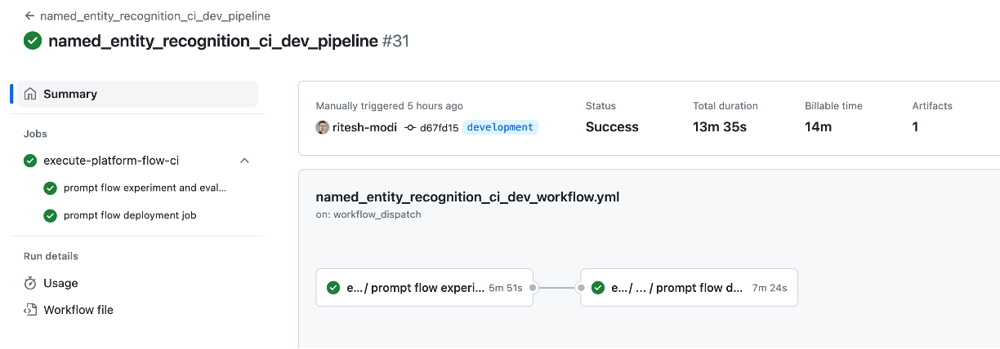
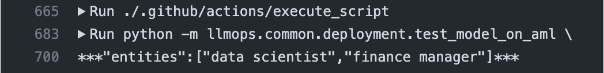

# How to setup the repo with Github Workflows

This template supports Azure Machine Learning (ML) as a platform for LLMOps, and Github workflows as a platform for Flow operationalization. LLMOps with Prompt flow provides automation of:

* Experimentation by executing flows
* Evaluation of prompts along with their variants  
* Registration of prompt flow 'flows'
* Deployment of prompt flow 'flows'
* Generation of Docker Image
* Deployment to Kubernetes, Azure Web Apps and Azure ML compute
* A/B deployments
* Role based access control (RBAC) permissions to deployment system managed id to key vault and Azure ML workspace
* Endpoint testing
* Report generation

It is important to understand how [Prompt flow works](https://learn.microsoft.com/en-us/azure/machine-learning/prompt-flow/get-started-prompt-flow?view=azureml-api-2) before using this template.

## Prerequisites

- An Azure subscription. If you don't have an Azure subscription, create a free account before you begin. Try the [free or paid version of Machine Learning](https://azure.microsoft.com/free/).
- An Azure Machine Learning workspace.
- Git running on your local machine.
- GitHub as the source control repository.
- Azure OpenAI with Model deployed with name `gpt-35-turbo`.
- In case of Kubernetes based deployment, Kubernetes resources and associating it with Azure Machine Learning workspace would be required. More details about using Kubernetes as compute in AzureML is available [here](https://learn.microsoft.com/en-us/azure/machine-learning/how-to-attach-kubernetes-anywhere?view=azureml-api-2).

The template deploys real-time online endpoints for flows. These endpoints have Managed ID assigned to them and in many cases they need access to Azure Machine learning workspace and its associated key vault. The template by default provides access to both the key vault and Azure Machine Learning workspace based on this [document](https://learn.microsoft.com/en-ca/azure/machine-learning/prompt-flow/how-to-deploy-for-real-time-inference?view=azureml-api-2#grant-permissions-to-the-endpoint).

## Create Azure service principal

Create one Azure service principal for the purpose of understanding this repository. You can add more depending on how many environments, you want to work on (Dev or Prod or Both). Service principals can be created using cloud shell, bash, powershell or from Azure UI.  If your subscription is part of an organization with multiple tenants, ensure that the Service Principal has access across tenants.

1. Copy the following bash commands to your computer and update the **spname** and **subscriptionId** variables with the values for your project. This command will also grant the **owner** role to the service principal in the subscription provided. This is required for GitHub Actions to properly use resources in that subscription.

    ``` bash
    spname="<provide a name to create a new sp name>"
    roleName="Owner"
    subscriptionId="<provide your subscription Id>"
    servicePrincipalName="Azure-ARM-${spname}"

    # Verify the ID of the active subscription
    echo "Using subscription ID $subscriptionID"
    echo "Creating SP for RBAC with name $servicePrincipalName, with role $roleName and in scopes     /subscriptions/$subscriptionId"

    az ad sp create-for-rbac --name $servicePrincipalName --role $roleName --scopes /subscriptions/$subscriptionId --sdk-auth

    echo "Please ensure that the information created here is properly save for future use."

1. Copy your edited commands into the Azure Shell and run them (**Ctrl** + **Shift** + **v**). If executing the commands on local machine, ensure Azure CLI is installed and successfully able to access after executing `az login` command. Azure CLI can be installed using information available [here](https://learn.microsoft.com/en-us/cli/azure/install-azure-cli)

1. After running these commands, you'll be presented with information related to the service principal. Save this information to a safe location, you'll use it later in the demo to configure GitHub.

`NOTE: The below information should never be part of your repository and its branches. These are important secrets and should never be pushed to any branch in any repository.`

    ```json

      {
      "clientId": "<service principal client id>",
      "clientSecret": "<service principal client secret>",
      "subscriptionId": "<Azure subscription id>",
      "tenantId": "<Azure tenant id>",
      "activeDirectoryEndpointUrl": "https://login.microsoftonline.com",
      "resourceManagerEndpointUrl": "https://management.azure.com/",
      "activeDirectoryGraphResourceId": "https://graph.windows.net/",
      "sqlManagementEndpointUrl": "https://management.core.windows.net:8443/",
      "galleryEndpointUrl": "https://gallery.azure.com/",
      "managementEndpointUrl": "https://management.core.windows.net/"
      }
    ```

1. Copy the output, braces included. It will be used later in the demo to configure GitHub Repo.

1. Close the Cloud Shell once the service principals are created.


## Setup runtime for Prompt flow

Prompt flow 'flows' require runtime associated with compute instance in Azure Machine Learning workspace. Both the compute instance and the associated runtime should be created prior to executing the flows. Both the Compute Instance and Prompt flow runtime should be created using the Service Principal. This ensures that Service Principal is the owner of these resources and Flows can be executed on them from both Azure DevOps pipelines and Github workflows. This repo provides Azure CLI commands to create both the compute instance and the runtime using Service Principal.

Compute Instances and Prompt flow runtimes can be created using cloud shell, local shells, or from Azure UI. If your subscription is a part of organization with multiple tenants, ensure that the Service Principal has access across tenants. The steps shown next can be executed from Cloud shell or any shell. The steps mentioned are using Cloud shell and they explicitly mentions any step that should not be executed in cloud shell.

### Steps:

1. Assign values to variables. Copy the following bash commands to your computer and update the variables with the values for your project. Note that there should not be any spaces between both side of "=" operator while assigning values to bash variables.

```bash
subscriptionId=<your azure subscription id>
rgname=<your resource group name>                                                                      
workspace_name=<your Azure machine learning workspace name> 
userAssignedId=<provide a name to create a new user assigned managed identifier>
keyvault=<your Azure machine learning workspace associate key vault name>
compute_name=<provide a name to create a new Azure ML compute>
location=<your Azure machine learning workspace region>
runtimeName=<provide a name to create a new Prompt Flow runtime>
sp_id=<your azure service principal or client id that was recently created>
sp_password=<your service principal password or clientSecret from previous step>
tenant_id=<your azure tenant id>
```

2. This next set of commands should not be performed from Cloud shell. It should be performed if you are using a local terminal. The commands help to interactively log in to Azure and selects a subscription.

```bash
az login
az account set -s $subscriptionId
```

3. Create a user-assigned managed identity

```bash
az identity create -g $rgname -n $userAssignedId --query "id"
```

4. Get id, principalId of user-assigned managed identity

```bash
um_details=$(az identity show -g $rgname -n $userAssignedId --query "[id, clientId, principalId]")
```

5. Get id of user-assigned managed identity

```bash
user_managed_id="$(echo $um_details | jq -r '.[0]')"
```

6. Get principal Id of user-assigned managed identity

```bash
principalId="$(echo $um_details | jq -r '.[2]')"
```

7. Grant the user managed identity permission to access the workspace (AzureML Data Scientist)

```bash
az role assignment create --assignee $principalId --role "AzureML Data Scientist" --scope "/subscriptions/$subscriptionId/resourcegroups/$rgname/providers/Microsoft.MachineLearningServices/workspaces/$workspace_name"
```

8. Grant the user managed identity permission to access the workspace keyvault (get and list)

```bash
az keyvault set-policy --name $keyvault --resource-group $rgname --object-id $principalId --secret-permissions get list
```

9. login with Service Principal

```bash
az login --service-principal -u $sp_id -p $sp_password --tenant $tenant_id
az account set -s $subscriptionId
```

10. Create compute instance and assign user managed identity to it

```bash
az ml compute create --name $compute_name --size Standard_E4s_v3 --identity-type UserAssigned --type ComputeInstance --resource-group $rgname --workspace-name $workspace_name --user-assigned-identities $user_managed_id
```

11. Get Service Principal Azure Entra token for REST API

```bash
access_token=$(az account get-access-token | jq -r ".accessToken")
```

12. Construct POST url for runtime

```bash
runtime_url_post=$(echo "https://ml.azure.com/api/$location/flow/api/subscriptions/$subscriptionId/resourceGroups/$rgname/providers/Microsoft.MachineLearningServices/workspaces/$workspace_name/FlowRuntimes/$runtimeName?asyncCall=true")
```

13. Construct GET url for runtime

```bash
runtime_url_get=$(echo "https://ml.azure.com/api/$location/flow/api/subscriptions/$subscriptionId/resourceGroups/$rgname/providers/Microsoft.MachineLearningServices/workspaces/$workspace_name/FlowRuntimes/$runtimeName")
```

14. Create runtime using REST API

```bash
curl --request POST \
  --url "$runtime_url_post" \
  --header "Authorization: Bearer $access_token" \
  --header 'Content-Type: application/json' \
  --data "{
    \"runtimeType\": \"ComputeInstance\",
    \"computeInstanceName\": \"$compute_name\",
}"
```

15. Get runtime creation status using REST API. Execute this step multiple times unless either you get output that shows createdOn with a valid date and time value or failure. In case of failure, troubleshoot the issue before moving forward.

```bash
curl --request GET \
  --url "$runtime_url_get" \
  --header "Authorization: Bearer $access_token"
```

The template also provides support for 'automatic runtime' where flows are executed within a runtime provisioned automatically during execution. This feature is in preview. The first execution might need additional time for provisioning of the runtime.

The template supports using 'automatic runtime' and dedicated compute instances and runtimes. This is configured in the `experiment.yaml` file (see file [description](./the_experiment_file.md) and [specs](./experiment.yaml)).


## Set up Github Repo

Fork this repository [LLMOps Prompt flow Template Repo](https://github.com/microsoft/llmops-promptflow-template) in your GitHub organization. This repo has reusable LLMOps code that can be used across multiple projects.



Create a *development* branch from *main* branch and also make it as default one to make sure that all PRs should go towards it. This template assumes that the team works at a *development* branch as a primary source for coding and improving the prompt quality. Later, you can implement Github workflows that move code from the *development* branch into qa/main or execute a release process right away. Release management is not in part of this template.



At this time, `main` is the default branch.



From the settings page, switch the default branch from `main` to `development`


It might ask for confirmation.



Eventually, the default branch in github repo should show `development` as the default branch.


The template comes with a few Github workflow related to Prompt flow flows for providing a jumpstart (named_entity_recognition, web_classification and math_coding). Each scenario has 2 primary workflows and 1 optional workflow. The first one is executed during pull request(PR) e.g. [named_entity_recognition_pr_dev_workflow.yml](../.github/workflows/named_entity_recognition_pr_dev_workflow.yml), and it helps to maintain code quality for all PRs. Usually, this pipeline uses a smaller dataset to make sure that the Prompt flow job can be completed fast enough.

The second Github workflow [named_entity_recognition_ci_dev_workflow.yml](../.github/workflows/named_entity_recognition_ci_dev_workflow.yml) is executed automatically before a PR is merged into the *development* or *main* branch. The main idea of this pipeline is to execute bulk run and evaluation on the full dataset for all prompt variants. The workflow can be modified and extended based on the project's requirements.

The optional third Github workflow [named_entity_recognition_post_prod_eval.yml](../.github/workflows/named_entity_recognition_post_prod_eval.yml) need to be executed manually after the deployment of the Prompt flow flow to production and collecting production logs (example log file - [production_log.jsonl](../named_entity_recognition/data/production_log.jsonl)). This workflow is used to evaluate the Prompt flow flow performance in production.

More details about how to create a basic Github workflows in general can be found [here](https://docs.github.com/en/actions/using-workflows).

- Another important step in this section is to enable workflows in the new repository just created after forking.


## Set up authentication with Azure and GitHub

From your GitHub project, select **Settings** -> **Secrets and  variables**,  **Actions** and **New repository secret**. Create a Github repository secret named 'AZURE_CREDENTIALS' with information related to Azure Service Principal. You can paste the service principal output as the content of the secret and use [this document](https://learn.microsoft.com/en-us/azure/developer/github/connect-from-azure?tabs=azure-portal%2Clinux#use-the-azure-login-action-with-a-service-principal-secret) as a reference.



## Set up GitHub variables for each environment

There are 3 variables expected as GitHub variables: `RESOURCE_GROUP_NAME`, `WORKSPACE_NAME` and `KEY_VAULT_NAME`. These values are environment specific, so we utilize the `Environments` feature in GitHub. 

From your GitHub project, select **Settings** -> **Environments**, select "New environment" and call it `dev`


Add a new variable for each of `RESOURCE_GROUP_NAME`, `WORKSPACE_NAME` and `KEY_VAULT_NAME` with the corresponding values from the `dev` environment. 


Repeat the same process for a new `pr` environment (you will likely want to reuse the same values as the `dev` environment). 

You should have 2 GitHub environments `pr` and `dev`, each with 3 variables `RESOURCE_GROUP_NAME`, `WORKSPACE_NAME` and `KEY_VAULT_NAME`. You can view all environment specific variables by navigating to **Settings** -> **Secrets and  variables**,  **Actions**, **Variables**. You should have something that looks like this: 



## Setup connections for Prompt flow

Prompt flow Connections helps securely store and manage secret keys or other sensitive credentials required for interacting with LLM and other external tools, for example Azure OpenAI.

This repository has 3 examples, and all the examples use a connection named `aoai` inside, we need to set up a connection with this name if we haven’t created it before.

This repository has all the examples use Azure OpenAI model `gpt-35-turbo` deployed with the same name `gpt-35-turbo`, we need to set up this deployment if we haven’t created it before.

Please go to Azure Machine Learning workspace portal, click `Prompt flow` -> `Connections` -> `Create` -> `Azure OpenAI`, then follow the instructions to create your own connections called `aoai`. Learn more on [connections](https://learn.microsoft.com/en-us/azure/machine-learning/prompt-flow/concept-connections?view=azureml-api-2). The samples use a connection named "aoai" connecting to a gpt-35-turbo model deployed with the same name in Azure OpenAI. This connection should be created before executing the out-of-box flows provided with the template.


The configuration for connection used while authoring the repo:


## Set up Secrets in GitHub

### Prompt flow Connection

Create a Github repository secret named 'COMMON_DEV_CONNECTIONS' with information related to Prompt flow connections.  The value for this secret is a json string with given structure as shown next. Create one json object for each connection as shown in example. As of now, Azure Open AI Connections are supported and more will get added soon. Information for each connection can be obtained from respective Azure OpenAI resource.

It is important to note that there can be any number of variables and each storing Prompt flow connection details as shown next and they can be named anything permissible based on your preference. You should use the same variable in your use-case related CI pipelines. The template by default uses 'COMMON_DEV_CONNECTIONS' for this purpose.

```json
[
{
	"name": "aoai",
	"type": "azure_open_ai",
    "api_base": "https://xxxxxxxxxxx/",
    "api_key": "xxxxxxxxxxxx",
    "api_type": "azure",
    "api_version": "2023-03-15-preview"
},
{
	"name": "another_connection",
	"type": "azure_open_ai",
    "api_base": "https://xxxxxxxxxxxx/",
    "api_key": "xxxxxxxxxxxx",
    "api_type": "azure",
    "api_version": "2023-03-15-preview"
}
]

```

### Azure Container Registry

Create another Github repository secret named 'DOCKER_IMAGE_REGISTRY' with information related to Docker Image Registry. The value for this secret is also a json string with given structure. Create one json object for each registry. As of now, Azure Container Registry are supported and more will get added soon. Information for each registry can be obtained from Azure Container Registry resource.

It is important to note that there can be any number of variables and each storing Azure Container Registry details as shown next and they can be named anything permissible based on your preference. You should use the same variable in your use-case related CI pipelines. The template by default uses 'DOCKER_IMAGE_REGISTRY' for this purpose.

```json
[
	{
		"registry_name" : "xxxxxxxx",
		"registry_server" : "xxxx.azurecr.io",
		"registry_username" : "xxxxxxxxx",
		"registry_password": "xxxxxxxxxxxxxx"
	}
]

```

## Cloning the repo

 Now, we can clone the forked repo on your local machine using command shown here. Replace the repo url with your url.

``` bash
git clone https://github.com/ritesh-modi/llmops-promptflow-template.git

cd llmops-promptflow-template

git branch

```

Create a new feature branch using the command shown here. Replace the branch name with your preferred name.

``` bash

git checkout -b featurebranch

```

The pipeline expects the variables `RESOURCE_GROUP_NAME`, `WORKSPACE_NAME` and `KEY_VAULT_NAME` to be available in a GitHub environment (this should have already been created and set [here](#set-up-github-variables-for-each-environment)). These variables should contain the values of the Azure resources in the dev environment.

The rest of the pipeline configurations will be read from the `experiment.yaml` file (see file [description](./the_experiment_file.md) and [specs](./experiment.yaml)); and from the `configs/deployment_config.json` file for the deployment.

Before running the deployment pipelines, you need to make changes to `configs/deployment_config.json`:
- Update the `ENDPOINT_NAME` and `CURRENT_DEPLOYMENT_NAME` if you want to deploy to Azure Machine Learning compute
- Or update the `CONNECTION_NAMES`, `REGISTRY_NAME`, `REGISTRY_RG_NAME`, `APP_PLAN_NAME`, `WEB_APP_NAME`, `WEB_APP_RG_NAME`, `WEB_APP_SKU`, and `USER_MANAGED_ID`if you want to deploy to Azure Web App.

### Update deployment_config.json in config folder

Modify the configuration values in the `deployment_config.json` file for each environment. These are required for deploying Prompt flows in Azure ML. Ensure the values for `ENDPOINT_NAME` and `CURRENT_DEPLOYMENT_NAME` are changed before pushing the changes to remote repository.

- `ENV_NAME`: This indicates the environment name, referring to the "development" or "production" or any other environment where the prompt will be deployed and used in real-world scenarios.
- `TEST_FILE_PATH`: The value represents the file path containing sample input used for testing the deployed model.
- `ENDPOINT_NAME`: The value represents the name or identifier of the deployed endpoint for the prompt flow.
- `ENDPOINT_DESC`: It provides a description of the endpoint. It describes the purpose of the endpoint, which is to serve a prompt flow online.
- `DEPLOYMENT_DESC`: It provides a description of the deployment itself.
- `PRIOR_DEPLOYMENT_NAME`: The name of prior deployment. Used during A/B deployment. The value is "" if there is only a single deployment. Refer to CURRENT_DEPLOYMENT_NAME property for the first deployment.
- `PRIOR_DEPLOYMENT_TRAFFIC_ALLOCATION`:  The traffic allocation of prior deployment. Used during A/B deployment. The value is "" if there is only a single deployment. Refer to CURRENT_DEPLOYMENT_TRAFFIC_ALLOCATION property for the first deployment.
- `CURRENT_DEPLOYMENT_NAME`: The name of current deployment.
- `CURRENT_DEPLOYMENT_TRAFFIC_ALLOCATION`: The traffic allocation of current deployment. A value of 100 indicates that all traffic is directed to this deployment.
- `DEPLOYMENT_VM_SIZE`: This parameter specifies the size or configuration of the virtual machine instances used for the deployment.
- `DEPLOYMENT_INSTANCE_COUNT`:This parameter specifies the number of instances (virtual machines) that should be deployed for this particular configuration.
- `ENVIRONMENT_VARIABLES`: This parameter represents a set of environment variables that can be passed to the deployment.

Kubernetes deployments have additional properties - `COMPUTE_NAME`, `DEPLOYMENT_VM_SIZE`, `CPU_ALLOCATION` and `MEMORY_ALLOCATION` related to infrastructure and resource requirements. These should also be updates with your values before executing Kubernetes based deployments.

Azure Web App deployments do not have similar properties as that of Kubernetes and Azure ML compute. For Azure Web App, following properties should be updated.

- `ENV_NAME`: This indicates the environment name, referring to the "development" or "production" or any other environment where the prompt will be deployed and used in real-world scenarios.
- `TEST_FILE_PATH`: The value represents the file path containing sample input used for testing the deployed model.
- `CONNECTION_NAMES`: The name of the connections used in standard flow in json aray format. e.g. ["aoai", "another_connection"],
- `REGISTRY_NAME`: This is the name of the Container Registry that is available in the `DOCKER_IMAGE_REGISTRY` secret. Based on this name, appropriate registry details will be used for `Docker` image management.
- `REGISTRY_RG_NAME`: This is the name of the resource group related to the Container Registry. It is used for downloading the Docker Image.
- `APP_PLAN_NAME`: Name of the App Services plan. It will be provisioned by the pipeline.
- `WEB_APP_NAME`: Name of the Web App. It will be provisioned by the pipeline.
- `WEB_APP_RG_NAME`:  Name of the resource group related to App Service plan and Web App. It will be provisioned by the pipeline.
- `WEB_APP_SKU`: This is the `SKU` (size) of the Web App. e.g. "B3"
- `USER_MANAGED_ID`: This is the name of the user defined managed id created during deployment associated with the Web App.

`NOTE: For Docker based deployments, ensure to add promptflow, promptflow[azure], promptflow-tools packages in each flow's requirements.txt file`. Check-out existing use-cases (named_entity_recognition, math_coding, web_classification) for examples.`

Now, push the new feature branch to the newly forked repo.

``` bash

git add .
git commit -m "changed code"
git push -u origin featurebranch

```

Raise a new PR to merge code from `feature branch` to the `development` branch. Ensure that the PR from feature branch to development branch happens within your repository and organization.



This should start the process of executing the Math_coding PR pipeline.


After the execution is complete, the code can be merged to the `development` branch.

Now a new PR can be opened from `development` branch to the `main` branch. This should execute both the PR as well as the CI pipeline.

## Update configurations for Prompt flow and GitHub Actions

There are multiple configuration files for enabling Prompt flow run and evaluation in Azure ML and Github workflows

### Update the experiment.yaml file

To make any changes to your experiment set-up, refer to the `experiment.yaml` in the base path of your use-case. This file configures your use-case including flows and datasets. (see file [description](./the_experiment_file.md) and [specs](./experiment.yaml) for more details)

### Update data folder with data files

Add your data into the `data` folder under the use case folder. It supports `jsonl` files and the examples already contains data files for both running and evaluating Prompt flows.

### Update Standard and evaluation flows

The `flows` folder contains one folder for each standard and evaluation flow. Each example in the repository already has these flows.

### Update Environment related dependencies

The `environment folder` contains dockerfile file for webapp and function app deployments. Any additional dependencies needed by the flow should be added to it. This file is used during deployment process.

### Update test data

The `sample-request.json` file contains a single test data used for testing the online endpoint after deployment in the pipeline. Each example has its own `sample-request.json` file and for custom flows, it should be updated to reflect test data needed for testing.

## Example Prompt Run, Evaluation and Deployment Scenario

There are three examples in this template. While `named_entity_recognition` and `math_coding` have the same functionality, `web_classification` has multiple evaluation flows and datasets for the dev environment. This is a flow in general across all examples.



This Github CI workflow contains the following steps:

**Run Prompts in Flow**
- Upload bulk run dataset
- Bulk run prompt flow based on dataset
- Bulk run each prompt variant

**Evaluate Results**
- Upload ground test dataset
- Execution of multiple evaluation flows for a single bulk run (only for web_classification)
- Evaluation of the bulk run result using single evaluation flow (for others)

**Register Prompt flow LLM App**
- Register Prompt flow as a Model in Azure Machine Learning Model Registry

**Deploy and Test LLM App**
- Deploy the Flow as a model to the development environment either as Kubernetes or Azure ML Compute endpoint
- Assign RBAC permissions to the newly deployed endpoint to Key Vault and Azure ML workspace
- Test the model/promptflow realtime endpoint.

**Run post production deployment evaluation**
- Upload the sampled production log dataset
- Execute the evaluation flow on the production log dataset
- Generate the evaluation report

### Online Endpoint

1. After the CI pipeline for an example scenario has run successfully, depending on the configuration it will either deploy to

      or to a Kubernetes compute type

     

2. Once pipeline execution completes, it would have successfully completed the test using data from `sample-request.json` file as well.

     

## Moving to production

The example scenario can be run and deployed both for Dev environments. When you are satisfied with the performance of the prompt evaluation pipeline, Prompt flow model, and deployment in development, additional pipelines similar to `dev` pipelines can be replicated and deployed in the Production environment.

The sample Prompt flow run & evaluation and GitHub workflows can be used as a starting point to adapt your own prompt engineering code and data.
