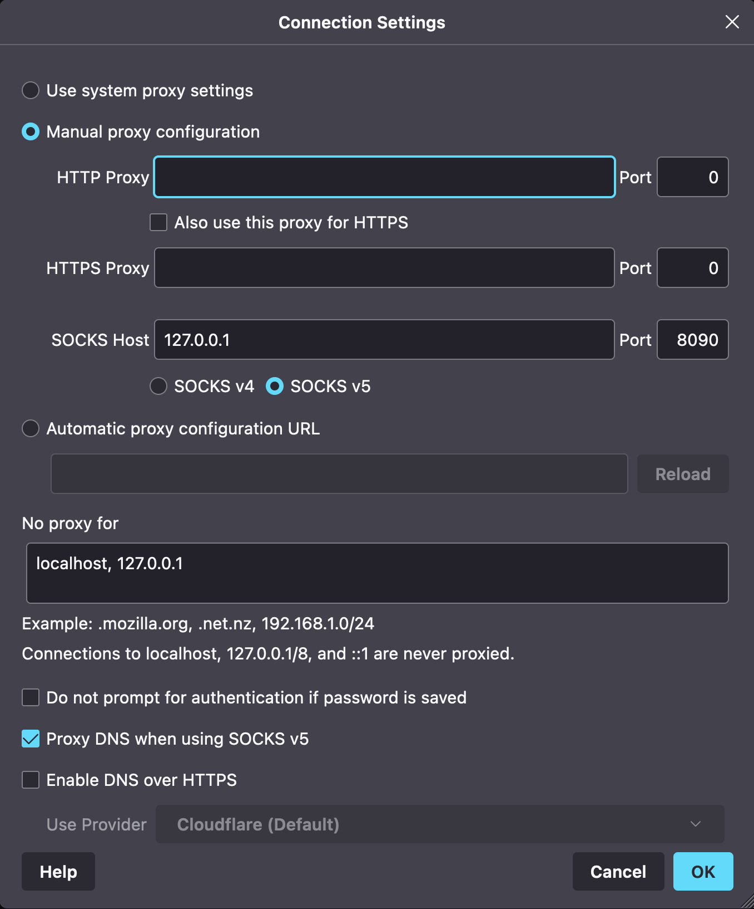

# Access the MLOps dev environment behind a VNET using SSH tunneling

If you deploy the MLOps dev environment with ```enableNetworkIsolation=true```, you can not access the resources behind the VNET.

Hence, we use SSH tunneling.
You have access to a virtual machine that will serve as a jumpbox. Here are the step to proceed:

1. Get the private key to access the jumpbox via ssh generated during deployment from the Keyvault

1. Navigate to the `~/.ssh` directory, and paste your clipboard into a new file:

```bash
/> vi jumpbox
# Paste the content, save and close
/> chmod 600 jumpbox # to have proper permissions on the file
```

1. Open SSH port for your IP onto the jumpbox.
    1. [Find what your IP is](https://www.whatsmyip.org/),
    1. Navigate to the jumpbox in the portal`,
    1. Click on `Networking` on the left,
    1. Add an `inbound port rule`

    

    Replace `source ip` with your IP and set a unique priority (lower than 65000)

1. Get the public IP of the jumpbox (from the Azure Portal).

1. Create a ssh tunel from your machine by running the command:

```bash
/> ssh -D 127.0.0.1:8090 -i ~/.ssh/jumpbox azureuser@vmsshlinux-agvhcsfgnjgjw.eastus.cloudapp.azure.com
# use -i to use the key copied previously
# azureuser is the default user name of the VM
```

The commands above opens a SSH connection to the jumpbox, exposing a local endpoint on port 8090.

You can navigate to the Azure resources by following the procedure hereafter:

1. Use Firefox to proxy HTTP requests through the SSH tunnel. In order not to change all the settings of your host network, the easiest way is to use [Firefox browser](https://www.mozilla.org/en-US/). It allows proxying directly, without impacting the whole machine.

    1. Install & start Firefox
    1. Open settings
    1. Scroll to the bottom, and open the Network settings
    1. Provide a Proxy, Port etc ... (see print screen below)

    

    1. You can now access resources on the portal from Firefox
