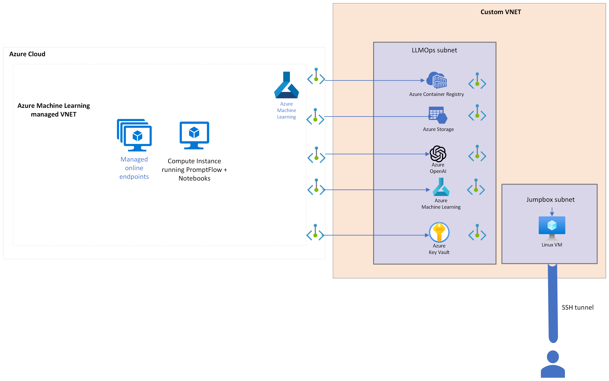

# Tutorial 02: Infra deployment with Bicep

## Introduction

This tutorial will help you create the following baseline infrastructure for the application using Bicep. You can make the choice whether you want to enable network isolation. The network isolation is done through a custom VNET and a [managed VNET for the Azure Machine Learning Workspace.](https://learn.microsoft.com/en-us/azure/machine-learning/how-to-managed-network?view=azureml-api-2&tabs=azure-cli).

## Architecture

### Base components

The following components are always deployed:

- Azure Machine Learning Workspace
- Azure OpenAI service
- Azure Application Insights
- Azure Key Vault
- Azure Storage Account
- Azure Container Registry

When network isolation is enabled, the following components are also deployed:

- Azure Virtual Network and required subnets
- Linux Virtual Machine to resort to SSH tunnelling to acces the Azure Machine Learning Workspace
- Azure Machine Learning Managed



### Network isolation

When you deploy the architecture with the bicep code with `enableNetworkIsolation=true`, the resources are deployed in a custom VNET and the Azure ML workspace uses a [managed VNET](https://learn.microsoft.com/en-us/azure/machine-learning/how-to-managed-network?view=azureml-api-2&tabs=azure-cli):


## Infra deployment script

### Deployment process

First make sure to create a resource group in which you'll deploy the infrastructure. The deployment is done through the [deploy-infra.sh script](../../infra/bicep/scripts/deploy-infra.sh). The script takes the following parameters:

- **ENV**: the environment where the resources are deployed (DEV, QA, PREPROD, PROD). ***Required***
- **RESOURCE_GROUP**: the resource group where the resources are deployed. ***Required***
- **NETWORK_ISOLATION**: trigger on/off network isolation for AML workspace and its dependant resources. ***Set to false by default***

If you want to further specify TENANT_ID and SUBSCRIPTION_ID to login to Azure or use a service principal, you can set following parameters:

- **APP_ID**: the APP_ID when you want to use a service principal to login to Azure
- **PASSWORD**: the PASSWORD when you want to use a service principal to login to Azure
- **TENANT_ID**: the TENANT_ID
- **SUBSCRIPTION_ID**: the SUBSCRIPTION_ID

The script does the following:
1. Login to Azure
1. Deploys the infrastructure using the [main.bicep file](../../infra/bicep/main.bicep) via the Azure CLI.
1. Exports the required outputs of the deployment (using the [export-deployment-variables.sh script](../../))to the deployment_config.json and llmops_config.json configuration files that you can use when deploying your flows.
1. Note that as opposed to custom VNET deployment, the bicep code **configures** the managed VNET for the Azure ML workspace, but **does not provision** it. Hence the scripts triggers the provisioning operation using the `az ml workspace provision-network` command. This operation can take up to 40 minutes.

Once the script finishes, you can use the deployment_config.json and llmops_config.json configuration files to deploy your flows, following the dedicated tutorials.

### Examples

**Example 1: Deploy the infrastructure in a resource group named `DevResourceGroup` for a `DEV` environment without network isolation. Azure Login relies on the identity of the person launching the script.**

```bash
bash ./deploy-infra.sh -e DEV -r DevResourceGroup"
```

**Example 2: Deploy the infrastructure in a resource group named `ProdResourceGroup` for a `PROD` with network isolation enabled. Azure Login relies on the identity of the person launching the script.**

```bash
bash ./deploy-infra.sh -e PROD -r ProdResourceGroup -i true"
```

**Example 3: Deploy the infrastructure in a resource group named `ProdResourceGroup` for a `PROD` with network isolation enabled. Azure login relies on a service principal.**

```bash
bash ./deploy-infra.sh -e PROD -r PRODResourceGroup -i true  -a 1234abcd-123a-1234-abcd-123456abcdef -p password -t 1234abcd-123a-1234-abcd-123456abcdef -s 1234abcd-123a-1234-abcd-123456abcdef"
```

### Connect to network-isolated AML workspace

In the above process, an SSH key-pair was generated in the ssh folder. You can use the private key to connect to the Linux VM and access the Azure Machine Learning workspace. The steps are detailed in the [Access the LLMOPs environment behind a VNET using SSH tunneling](./ssh_tunelling_access_workspace_vnet.md) tutorial.
