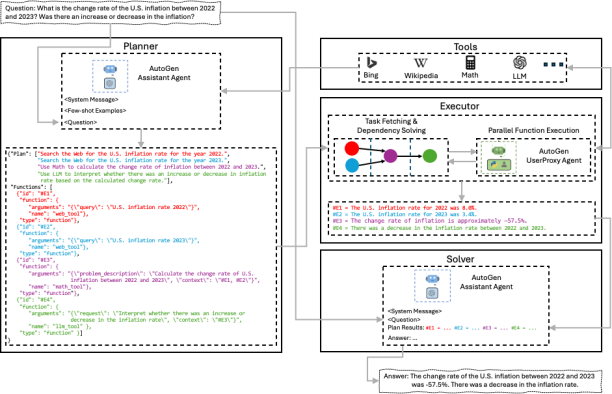
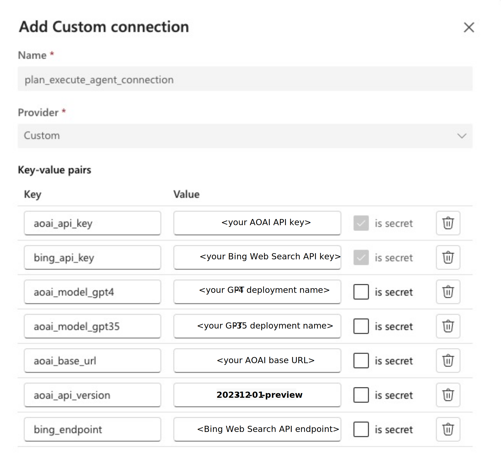

# Plan and Execute with LLM Agents

This is an example implementation of an agentic flow, capable of planning the steps needed to execute a user's request, then efficiently executing the plan through external function calling, and assembling a final response.

It implements the core ideas from these two papers:
- [ReWOO: Decoupling Reasoning from Observations for Efficient Augmented Language Models](https://arxiv.org/abs/2305.18323)
- [An LLM Compiler for Parallel Function Calling](https://arxiv.org/abs/2312.04511)

The idea is to optimize the traditional loop of reasoning and acting for planning and executing tasks with LLM-based agents, usually implemented by the [ReAct pattern](https://arxiv.org/abs/2210.03629), where the planning and acting steps are interleaved in a sequential manner.

By decoupling the planning from the acting, we make several potential optimizations possible:
- by having a separate LLM agent concerned with the planning only, we open up the possibility of fine-tuning a specialized model, which could lead to more efficiency and reduced costs, depending on the scenario.
- by having a separate component for orchestrating external tools calling for the execution of the plan steps, we can optimize for latency by executing functions in parallel, when they are not dependent from each other.

This implementation also uses components of the [Microsoft's AutoGen framework](https://github.com/microsoft/autogen), to facilitate the interaction with LLMs in all modules and execute external functions, as explained in the Architecture Overview below.

## Architecture Overview

The main components of this implementation are depicted in the architecture diagram above. Planner, Executor, and Solver are implemented as Prompt flow Python nodes. Tools are implemented as standard Python functions.

### Planner
The Planner is implemented as an [AutoGen AssistantAgent](https://microsoft.github.io/autogen/docs/reference/agentchat/assistant_agent). Its system message with few shot examples is implemented as a Prompt flow prompt. Planner is aware of the available tools capabilities and how to use them. It takes as input a user's request and is instructed to generate a step-by-step plan to solve it. The plan is specified to be generated as a valid JSON object, with a list of descriptions for each plan step, and a list of functions to be called to solve each step. Dependencies between those functions are specified as variable assignments using a specific notation.

### Executor
The Executor is implemented as a combination of custom Python code and an [AutoGen UserProxyAgent](https://microsoft.github.io/autogen/docs/reference/agentchat/user_proxy_agent/). It takes the generated plan as input. The custom Python code takes care of fetching function calls from the plan, solving function dependencies, dispatching functions for execution, and collecting results. The AutoGen UserProxyAgent facilitates the actual execution of Python functions, including parallel execution, as it already has these functionalities implemented. The output of Executor is a list with the results from all plan steps.

### Tools
Tools are implemented as standard Python functions, but strongly typed. In this way, they can seamlessly be registered within Autogen AssistantAgent and UserProxyAgent, without the need of maintaining a separate function definitions dictionary.

### Solver
The Solver is also implemented as an AutoGen AssistantAgent. Its system message is implemented as a Prompt flow prompt. It takes as input the user's request and the plan steps results and is instructed to use the information from the plan step results to answer the user's request.

## How to setup and deploy this flow
This example supports Azure DevOps pipelines as a platform for Flow operationalization. Please follow the instructions in [How to setup the repo with Azure DevOps](https://github.com/microsoft/llmops-promptflow-template/blob/main/docs/Azure_devops_how_to_setup.md).

### Prerequisites
Follow the prerequisites in [How to setup the repo with Azure DevOps](https://github.com/microsoft/llmops-promptflow-template/blob/main/docs/Azure_devops_how_to_setup.md). After that, you will also need the following:

- a Bing Web Search API key. You create one in your Azure subscription following the instructions [here](https://aka.ms/bingapisignup).
- a `gpt-35-turbo` and a `gpt-4` model deployment on your Azure Open AI service. Both should be under the same service (same base URL).
- a Prompt flow custom connection. Please see below.

Create a Prompt flow connection of type Custom and name it `plan_execute_agent_connection`. To do so, go to your Azure Machine Learning workspace portal, click `Prompt flow` -> `Connections` -> `Create` -> `Custom`. Fill in the key-value pairs according to the figure below:

